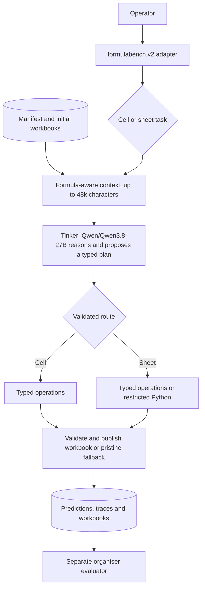
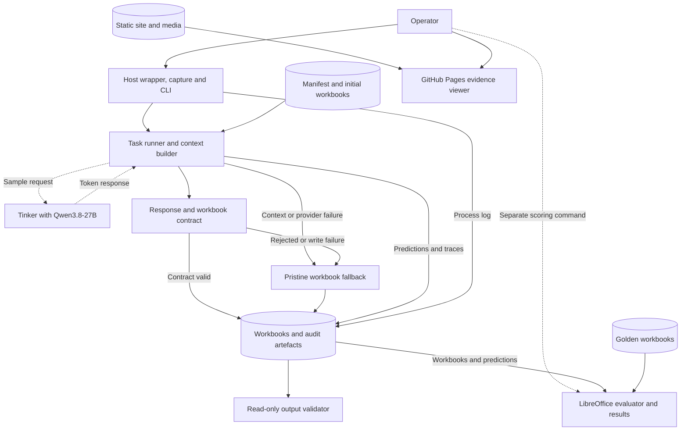
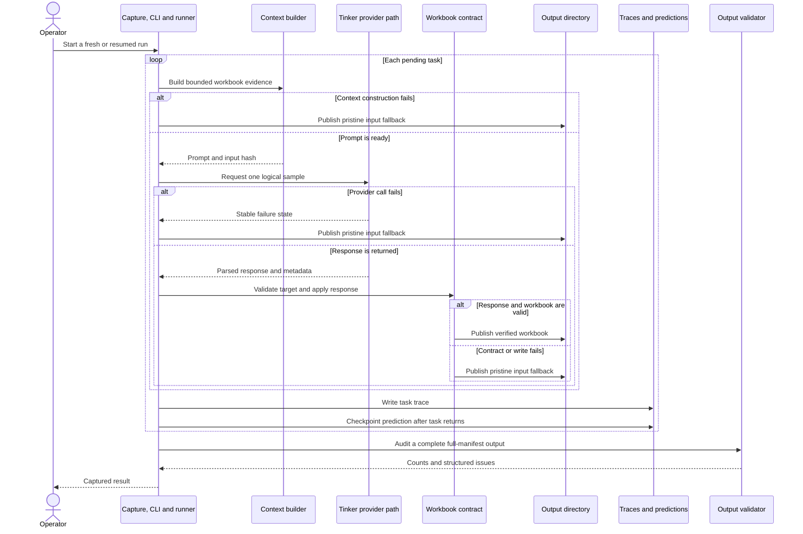

# System Architecture: FormulaBench

## Overview

FormulaBench is a single-host, filesystem-backed batch pipeline for Excel formula generation. The
current default, `formulabench.v2`, is an unscored parity candidate backed by a vendored copy of
ExactSource. The historical v1 engine and its 33.25% result remain intact behind the explicit
`--legacy-engine` adapter route. No FormulaBench v2 score or same-or-better claim exists until a
fresh 400-task evaluator run is complete.

The canonical v2 container installs FormulaBench as a non-editable distribution. This matters for
sheet-level transformations: ExactSource starts its screened worker with Python isolated mode, so
the worker must import `exactsource` from the installed environment rather than relying on the
container working directory. The v2 adapter also fixes openpyxl's XML serialiser choice in the
trusted parent and in the worker's existing allow-listed environment. The legacy route never
installs that adapter hook.

The submitted inference runtime is a Python CLI packaged in Docker. It exposes no web client or HTTP
API and uses no database, message broker or continuously running inference service. A separate
read-only evidence viewer under `docs/` is deployed as a static GitHub Pages site. It presents the
frozen public result, demo video and deck, but cannot invoke the inference pipeline. The production
inference loader deliberately neither discovers nor opens golden workbooks. The Docker wrapper
mounts the whole public dataset, so this is an application-level code boundary rather than
filesystem isolation. The separate evaluator and an explicitly labelled offline aggregate audit do
open golden workbooks.

### Version scope

The v2 path vendors ExactSource source current at commit
`99fe8084bf35a5fca6a2c2e1c9beae802766a618`. Its inference core matches the exact core scored in
ExactSource commit `8b84dba1d9263e2123b8f15267239b70ff817907`. Source parity does not transfer
ExactSource's score to FormulaBench v2. Sections explicitly headed "Historical v1" document the
retained submission engine and evidence rather than the default runtime.

## Current v2 Architecture

The container enters through `python -m formulabench.v2 --dataset-dir=/data --out-dir=/out`. The
adapter translates FormulaBench's mount contract into the vendored ExactSource runner. It also
implements `--legacy-engine`, which delegates to the unchanged v1 capture path, and supports a
zero-provider-call `--preflight-only` check. v2 otherwise accepts fresh runs only.

The v2 runner classifies each task as cell-level or sheet-level, then builds up to 48,000
characters of formula-aware workbook context. Qwen reasons over that evidence and returns a typed
plan. Cell-level tasks can use only declared spreadsheet operations. Sheet-level tasks may use the
same operations or screened Python executed as a restricted transform against a temporary
workbook copy. Typed-operation plans enforce TaskSpec answer-range containment, plan resource
limits, formula safety and workbook-save constraints before publication. The screened-Python route
instead applies AST screening and reduced capabilities, checks changed formulas, formula metadata
and cell hyperlinks, enforces the output-size limit, checks workbook readability, and requires
declared answer sheets to remain present. It does not enforce TaskSpec answer-range containment or
general workbook-structure preservation. A rejected plan or transform produces a pristine input
fallback.

Each task has one bounded second-call allowance. A completed but invalid plan may receive one
ordinary semantic-repair call. Alternatively, an initially truncated cell response may receive
one larger no-think-requested recovery call. These cases are mutually exclusive; there is never a
third call. Reasoning is requested for initial calls and ordinary semantic repair. The recovery
setting is a bounded completion strategy, not a correctness guarantee.

That second-call limit counts logical model completions. Within each logical call, the fixed HTTP
transport may retry a qualifying transient failure up to two times, subject to bounded connection,
read, write, pool and `Retry-After` waits. Traces distinguish transport attempts from logical calls.

### Current v2 operational controls

- The adapter accepts only a fresh, empty output root and holds a non-blocking POSIX advisory lock
  on that directory's inode from the freshness check until final permission hardening. A second
  cooperating v2 process therefore fails before inference rather than sharing the run.
- The output root and its managed subdirectories are set to `0700`; regular artefacts are set to
  `0600`. Symlinks and other unexpected filesystem entry types fail closed. These controls protect
  the local batch artefacts from other ordinary host users, subject to the host account and
  filesystem enforcing POSIX permissions.
- The adapter rejects a runtime containing Pillow or an effective openpyxl `lxml` serialiser before
  it loads tasks, creates output or calls Tinker. The canonical Docker image excludes both optional
  dependencies and selects the standard-library XML path in the trusted parent and transformation
  child.
- The host wrapper resolves the dataset and output paths and rejects equality or either path being
  inside the other. It owns the `/data` and `/out` arguments, appends those fixed mount paths after
  user arguments, mounts the dataset read-only, and does not pass Tinker environment variables to
  preflight or credential-free legacy replay. Paid v2 runs receive only `TINKER_API_KEY`; the
  v1-only `TINKER_PROJECT_ID` is forwarded only when `--legacy-engine` is selected.

The Python sheet route is defence in depth for benchmark-generated transformations, not a
general-purpose untrusted-code sandbox. It applies AST screening, a reduced built-in namespace,
allow-listed helpers and environment variables, a temporary workbook copy, a timeout and resource
limits. However, the child runs as the same unprivileged container user as the coordinator and the
ordinary inference container needs outbound network access for Tinker. An unknown Python sandbox
escape could therefore reach capabilities available to that container user. Real private-market
workbooks need stronger OS-level isolation, provider governance and a trace-retention policy.

### Current v2 reliability limits

- Concurrency is fixed at four to preserve the migrated runtime contract.
- v2 has no resume or retry mode. An interruption leaves a partial directory for inspection; a new
  attempt must use a different empty output root.
- The directory lock is a single-host, cooperative filesystem control. It is not a distributed
  lease and does not defend against a privileged or malicious process replacing path components.
- Workbook reopen and contract checks establish structural validity, not formula correctness.
  Correctness still requires the separate LibreOffice-based organiser evaluator.
- The full 400-task source run took approximately 6 hours 39 minutes. Hosted model responses can
  vary even at temperature zero, so source parity and deterministic plan replay do not guarantee a
  repeat score.

## Historical v1 Key Requirements

- **Evaluator-compatible targets:** resolve sheet-qualified cells and ranges with the supplied
  SpreadsheetBench target parser.
- **Bounded model input:** keep the authored prompt within 20,000 characters while retaining
  formula structure, cached values and relevant spatial evidence.
- **Strict output coverage:** require the returned cells, fills and preserved ranges to cover the
  requested target exactly once.
- **Safe workbook changes:** reject explicit external references and high-risk formula functions,
  then save and reopen every accepted workbook before publication.
- **Fail-closed execution:** publish a byte-identical copy of the initial workbook when context
  construction, sampling, validation or writing fails.
- **Reproducibility:** fix the configured model identifier and pin the tokenizer revision, renderer,
  application and runtime dependency resolution, sampling settings and default container images.
- **Cost control:** request one logical sample for each attempt that reaches the provider and
  require an explicit command before a failed task can attempt another provider call.
- **Controlled throughput:** support bounded provider concurrency while keeping one coordinator in
  sole control of each output directory.
- **Auditability:** retain one canonical workbook and trace file per task, one prediction record per
  task in the shared manifest and an append-only process log. Detailed trace content starts only
  when a model attempt begins.
- **Recoverability:** validate checkpoint state before resume and use a transaction journal when a
  failed checkpoint is replaced.
- **Evaluation integrity:** keep golden-workbook discovery and access out of the production
  inference loader and call path.
- **Credential isolation:** accept provider credentials through the environment, disable Tinker
  telemetry and support non-inference checks without a key.
- **Evidence publication:** present frozen public results without upload, provider or inference
  capability in the hosted surface.

## Historical v1 High-Level Architecture

The host wrapper prepares a finite batch run and passes the dataset and output roots to the
FormulaBench process. The runner builds workbook context, uses the external Tinker service for
inference, checks the response contract and records one complete result as each selected task
completes.

Dotted arrows mark external service calls or separately invoked commands. Solid arrows show
data or control flow within each operation. A failed or unsafe response never reaches a partially
edited published workbook. A complete full-manifest run invokes validation automatically, while
validation can also run independently. Scoring and the aggregate audit are separately invoked, and
only those two operations use golden workbooks through their documented code paths. The separate
Pages site serves committed static evidence and has no control path into the inference runtime.

### Trust boundaries

1. **Build boundary:** Docker installs the locked application and runtime dependency set and checks
   the pinned Qwen tokenizer assets against committed SHA-256 values.
2. **Runtime data boundary:** `scripts/run_docker.sh` rejects equal or nested resolved host paths,
   then mounts the dataset read-only at `/data` and the selected output directory read-write at
   `/out`.
3. **Provider boundary:** v2 sends the prompt and sampling parameters through its fixed direct HTTP
   transport; historical v1 uses the native Tinker SDK. The model receives no shell, Python
   interpreter or unrestricted file tool.
4. **Evaluation boundary:** the production inference loader does not discover or open golden
   workbooks. The evaluator and explicitly labelled aggregate audit do. Because the whole public
   dataset is mounted, this boundary relies on code structure rather than filesystem isolation.

## Historical v1 Component Details

### Host wrapper and container entry point

- **Responsibilities:** validate and reject overlapping resolved host paths, build the runtime
  image, mount the dataset and output directories, forward the supported environment variables and
  start the batch process.
- **Technology:** POSIX shell and Docker, implemented in
  [`scripts/run_docker.sh`](scripts/run_docker.sh) and
  [`scripts/container_entrypoint.sh`](scripts/container_entrypoint.sh).
- **Data:** owns no application state. It maps the host dataset to `/data` and the output root to
  `/out`.
- **Communication:** the current entry point executes `python -m formulabench.v2`; its explicit
  `--legacy-engine` route delegates to `python -m formulabench.capture`. Both provider paths need
  outbound network access for Tinker inference.

### Capture supervisor and CLI coordinator

- **Responsibilities:** capture the child process output, forward termination signals, validate
  arguments, select tasks and choose fresh, resume, retry, replay or preflight behaviour.
- **Technology:** Python subprocess supervision in
  [`formulabench/capture.py`](formulabench/capture.py) and command coordination in
  [`formulabench/cli.py`](formulabench/cli.py).
- **Data:** exclusively creates or appends `run.log` and holds the output-root lock for the run.
- **Communication:** starts the runner only when inference work remains, calls replay when selected
  and invokes complete-tree validation after a full-manifest run.

### Artefact and checkpoint layer

- **Responsibilities:** discover and validate dataset tasks, confine paths, define the canonical
  output layout, manage locks, validate resume state and publish checkpoint changes atomically.
- **Technology:** Python filesystem primitives, `fcntl` locking on supported POSIX systems and
  SHA-256 binding in [`formulabench/artifacts.py`](formulabench/artifacts.py).
- **Data:** `DatasetTask` records, `predictions.jsonl`, canonical workbook and trace paths, and the
  temporary `.retry/` transaction journal.
- **Communication:** supplies immutable task metadata to the runner and durable file operations to
  the runner, replay path and validator.

### Context and prompt builder

- **Responsibilities:** inspect the initial workbook in formula and cached-value modes, summarise
  the target, select deterministic workbook evidence and enforce the authored prompt budget.
- **Technology:** Python and openpyxl in [`formulabench/context.py`](formulabench/context.py), with
  fixed instructions from [`formulabench/prompts.py`](formulabench/prompts.py).
- **Data:** an ephemeral `ContextDocument` containing JSONL evidence, accounting fields and the
  initial workbook hash.
- **Communication:** reads only the validated initial workbook and passes a completed prompt to the
  task runner. It does not persist or inspect golden workbooks.

### Tinker provider adapter

- **Responsibilities:** load the pinned chat template, render the prompt to token IDs, obtain one
  logical model sample and strictly parse the terminal response.
- **Technology:** Tinker SDK `0.27.1`, Transformers `5.5.4` and Tokenizers `0.22.2` in
  [`formulabench/provider.py`](formulabench/provider.py).
- **Data:** a shared sampling client, renderer metadata, token counts, stop reason and bounded
  provider failure state. It owns no persistent workbook data.
- **Communication:** sends prompt tokens and fixed sampling parameters to Tinker, then returns a
  normalised response and request metadata to the runner.

### Response contract and workbook writer

- **Responsibilities:** resolve the target, parse the Pydantic response, expand fills, enforce
  exact coverage, screen formulas and publish a verified workbook or pristine fallback.
- **Technology:** Pydantic 2 and openpyxl in
  [`formulabench/contract.py`](formulabench/contract.py).
- **Data:** `TargetContract`, `SpreadsheetResponse`, expanded assignments, validation results and
  the final task workbook.
- **Communication:** consumes the task, model response and pristine workbook. It writes a temporary
  candidate, reopens it to verify workbook structure and assigned-value round trips, and atomically
  replaces the canonical output only after those checks pass.

### Task runner

- **Responsibilities:** orchestrate task stages, bound provider concurrency, convert failures to
  stable codes and checkpoint every completed task in manifest order.
- **Technology:** Python `asyncio` in [`formulabench/runner.py`](formulabench/runner.py).
- **Data:** transient task results, prompt and response metadata, plus the persistent prediction and
  trace records it asks the artefact layer to publish.
- **Communication:** calls the context builder, provider and contract writer. An `asyncio.Semaphore`
  limits only the remote sampling section.

### Replay and output validation

- **Responsibilities:** rematerialise eligible stored write failures without another provider call,
  and inspect the complete output tree without changing it.
- **Technology:** Python in [`formulabench/replay.py`](formulabench/replay.py) and
  [`formulabench/validate_out.py`](formulabench/validate_out.py).
- **Data:** hash-bound stored responses, replacement transactions and an in-memory validation
  report. The validator owns no persistent state.
- **Communication:** replay reuses the contract writer and checkpoint journal. The validator reads
  dataset metadata, predictions, workbooks and traces. It scans an explicitly named environment
  value only when that value contains at least eight bytes.

### Evaluation and offline analysis

- **Responsibilities:** recalculate generated workbooks, compare requested targets with golden
  workbooks and write task-level plus aggregate evaluation metrics. A separately labelled research
  script computes bounded aggregate properties from the public benchmark.
- **Technology:** the organiser-supplied Python evaluator and headless LibreOffice Calc, exposed by
  [`evaluate.py`](evaluate.py) and [`sb.py`](sb.py), plus the offline audit under
  [`experiments/`](experiments/).
- **Data:** generated workbooks, golden workbooks, `results.json` and the separate
  `experiments/public_benchmark_audit.json` research output.
- **Communication:** these commands read golden workbooks only when invoked explicitly. They do not
  call Tinker and do not form part of the production inference call path.

### Static evidence viewer

- **Responsibilities:** present the frozen public result, method, limits, demo video and presentation
  to judges and reviewers without accepting workbook uploads or model requests.
- **Technology:** static HTML, CSS and vanilla JavaScript in [`docs/`](docs/), served by GitHub Pages
  through [`.github/workflows/pages.yml`](.github/workflows/pages.yml).
- **Data:** committed aggregate figures, explanatory copy, the rendered MP4, WebVTT captions, PDF
  deck and editable PowerPoint. It does not read the run directory dynamically.
- **Communication:** a browser downloads static files from GitHub Pages and can follow links to the
  public repository. There is no application API or control path to Tinker or the inference runtime.

## Historical v1 Data Flow

The following sequence shows a normal task and the failure branch that preserves a complete,
scorable output set.

The sequence separates provider sampling, workbook-contract enforcement and artefact publication.
Each failure branch publishes a pristine workbook, so a complete batch remains structurally
scorable even when a task does not produce a contract-valid output.

The checkpoint records the trace before rewriting `predictions.jsonl`. A hard interruption between
those operations may leave an orphan, so resume rejects inconsistent state instead of guessing how
to repair it.

### Execution modes

- **Fresh run:** requires an empty output directory, attempts every selected task and samples only
  tasks that reach the provider.
- **Resume:** reuses validated checkpoints and does not repeat recorded failures.
- **Retry failures:** requires `--resume` and reschedules validated failures. A task may consume
  credits or incur cost only if it reaches the provider.
- **Stored-response replay:** handles eligible `workbook_write_failed` records from hash-bound
  traces without a credential or model call.
- **Preflight:** verifies the local SDK, tokenizer, stop token and rendering contract without
  sampling the model.
- **Evaluation:** runs after inference and may recalculate workbooks with LibreOffice before
  computing correctness metrics. Scoring should be terminal for a resumable output root, or write
  `results.json` elsewhere, because resume rejects extra root entries.

## Historical v1 Data Model

| Entity or artefact | Key fields and constraints | Relationship and lifecycle |
| --- | --- | --- |
| `DatasetTask` | Safe task `id`, instruction, relative workbook path and organiser target metadata | Loaded from `dataset.json`. References exactly one validated initial workbook. |
| `TargetContract` | Ordered target ranges with resolved sheet, source notation and dynamic-range state | Derived from a task for both prompt construction and write validation. |
| `ContextDocument` | JSONL evidence, prompt budget, included and omitted cell counts, truncation state and input SHA-256 | Built from one initial workbook. Its accounting metadata reaches the trace only after a parsed provider completion. |
| `SpreadsheetResponse` | Required cell assignments plus optional fills, preserved ranges and unmerge ranges | Parsed strictly. Extra fields, coercion and non-finite numbers are rejected. |
| Validation result | Expected, missing, duplicate, extra and preserved cells, plus stable failure codes. Duplicate detection also represents overlapping expansions. | Determines whether the response reaches the writer or the fallback path. |
| Output workbook | `outputs/<task-id>.xlsx` | Contains validated target changes after an openpyxl round trip, or a byte-identical copy of the initial workbook. Unsupported workbook extensions can be normalised or removed on a successful openpyxl save. |
| Prediction record | Task ID, canonical relative output, status and failure codes | One line in `predictions.jsonl`. Acts as the primary completion checkpoint. |
| Trace record | Prompt, parsed provider response or null, model metadata, token counts, latency and failure state. A contract-rejected response can still appear here. | Stored in `traces/<task-id>.jsonl`. A context-build failure may produce an empty trace. |
| Retry journal | Old and new workbook, trace and prediction data with their hashes | Temporary `.retry/<task-id>/` transaction used only while replacing a failed checkpoint. |
| Evaluation result | Aggregate summary and per-task correctness items | Written by the separate evaluator. Keep it outside a root that may be resumed, or treat scoring as terminal, because additional root files fail resume validation. |
| Published evidence bundle | Static pages, embedded aggregate figures, video, captions and deck files under `docs/` | Versioned with the repository and deployed separately from inference. It is not generated from the run directory at request time. |

The committed reference run contains 400 prediction records, 400 workbooks and 400 trace files.
It records 354 contract-valid outputs and 46 fail-closed fallbacks. The separate self-evaluation passed
133 tasks.

## Infrastructure & Deployment

### Development

Developers can run the package directly with Python 3.12.11 for parity with the current image. The
project declares `>=3.11,<3.14`, matching the vendored engine's supported range, but CI does not
test a multi-version Python matrix. Application and runtime dependency resolution uses the
committed `uv.lock`. A direct v2 run fails closed if the
optional native-Tinker environment has introduced Pillow or `lxml`; `uv sync --locked` restores the
exact base environment, while Docker remains the submission path. The dataset remains outside Git.
The v2 Docker wrapper requires a Tinker credential for a paid fresh run but not preflight. The v1
wrapper requires it for every mode except preflight and stored-response replay, including a fully
completed resume.

### Submitted runtime

The multi-stage [`Dockerfile`](Dockerfile) has three relevant user-facing targets in addition to
its base stages:

- `build` installs the locked application and runtime dependency set and verifies the pinned
  tokenizer assets.
- `contract-test` adds the project and tests, then runs the credential-free contract suite.
- `runtime` copies only the installed environment, tokenizer cache, both the `formulabench` and
  vendored `exactsource` packages, `sb.py`, the ExactSource licence notice and the entry point into
  the same pinned Python 3.12.11 slim image used by the scored ExactSource core.

The runtime image defaults to unprivileged UID and GID `10001`. The installed environment,
tokenizer cache, source packages and entry point remain root-owned and non-writable by that
identity. The wrapper overrides the runtime IDs with the invoking host user's IDs so bind-mounted
outputs remain writable and host-owned; those arbitrary IDs also receive read/execute-only access
to the application assets. The image exposes no port and exits when the finite batch ends.

### Continuous integration

GitHub Actions runs on Ubuntu 24.04 for each push and pull request. The workflow runs pytest and
Ruff across FormulaBench and vendored ExactSource, smoke-tests the v2 import and entry point,
builds a wheel, builds the contract-test and runtime images, checks an arbitrary-user runtime
smoke test, downloads the checksum-verified public dataset and verifies the frozen 400-task
contract. CI does not call Tinker or recalculate the public benchmark result.

### Static evidence deployment

GitHub Pages serves the committed `docs/` directory at
[masterasnackin.github.io/FormulaBench](https://masterasnackin.github.io/FormulaBench/). A push to
`main` that changes `docs/**` or the Pages workflow starts the `Deploy research demo` action. The
workflow checks out the repository, uploads `docs/` as a Pages artefact and deploys it with pinned
GitHub Actions. It has `contents: read`, `pages: write` and `id-token: write` permissions, and it
does not build or invoke the inference runtime.

### Evaluation environment

The evaluator runs separately with access to the generated and golden workbooks plus a local
LibreOffice executable. The retained submission records that its evaluation used disabled
networking, a read-only root filesystem and dropped capabilities. The repository does not include
the exact invocation or a hardened evaluation wrapper, so those conditions are recorded run
provenance rather than a reproducible control of `scripts/run_docker.sh`.

### Environment model

The repository defines development, CI, submitted inference runtime, separate evaluation and a
public static-evidence environment. The only hosted surface is the GitHub Pages viewer. There is no
staging environment, hosted inference service, container registry publication or broader release
and infrastructure automation beyond the Pages workflow.

### Network dependencies

- Image builds need the container registry, Python package source and Hugging Face tokenizer files.
- A fresh dataset download uses Hugging Face and checks the archive against a pinned SHA-256.
- The runtime needs outbound access to Tinker when inference remains pending.
- A direct host run may also contact Hugging Face when the tokenizer cache is empty and offline mode
  has not been enabled.
- Scoring needs a local LibreOffice process but does not call Tinker.
- Optional comparison scripts may use OpenRouter or Tinker when run explicitly.
- Browsers download the public evidence site and its static media from GitHub Pages. The site makes
  no inference or workbook-data request.

## Historical v1 Scalability & Reliability

### Load handling

- Maximum concurrent remote sampling calls range from 1 to 64 and default to 4.
- One shared Tinker client serves all tasks in a process.
- The semaphore limits remote sampling, while context construction and workbook writing remain
  synchronous.
- All pending tasks are created in one process, which suits the 400-task benchmark but does not
  form a distributed or bounded worker queue.
- `predictions.jsonl` is rewritten after each completion, so checkpoint write volume grows faster
  than the task count.
- One output-root lock prevents multiple processes from publishing into the same run.

### Failure handling

- FormulaBench converts task failures into stable codes and publishes a pristine fallback.
- Normal resume validates predictions, workbooks and traces before scheduling remaining work.
- Automatic resampling is disabled. The operator must select `--retry-failures`, and a rescheduled
  task may consume credits or incur cost if it reaches the provider.
- A hash-bound transaction journal makes failed-checkpoint replacement recoverable.
- Stored-response replay can repair one eligible failure class without another provider call.
- A fatal provider circuit stops further sampling after selected client and authorisation errors.
- Workbook candidates are saved, reopened and checked before canonical replacement.

### Known limits

- FormulaBench sets no application-level provider timeout.
- The Tinker SDK may retry idempotent submission or retrieval for the same logical sample even
  though FormulaBench disables its own HTTP and sampling retries.
- Large workbook operations can block the single event-loop thread.
- A hard interruption before prediction checkpointing can leave an orphan workbook or trace that
  requires operator inspection.
- Reopening verifies workbook structure and assigned values, not calculated formula correctness.
- The filesystem design supports one host and one coordinator per output root.
- There is no replication, automatic failover or remote recovery. Availability and long-term
  durability depend on the host filesystem and any backups managed outside FormulaBench.
- Normal workbook publication uses temporary files and `os.replace` for atomic visibility, but it
  does not fsync the workbook and parent directory. The checkpoint and retry helpers use stronger
  synchronisation, so power-loss durability differs between artefact types.

## Historical v1 Security & Compliance

### Implemented controls

- Production credentials come from environment variables. The production CLI does not read a
  `.env` file and never needs a credential for tests, preflight, validation or eligible replay.
  Optional baseline scripts have their own `.env` behaviour.
- Tinker telemetry is disabled before client construction and in the runtime container.
- Task IDs, manifest-relative paths and managed canonical artefact entries reject traversal,
  unsafe names, symlink components and unexpected file types. Caller-supplied root paths are
  resolved, and the Docker wrapper separately rejects a symlink output root.
- The inference loader discovers only the manifest and initial workbooks, not golden workbooks.
- The static formula gate rejects explicit workbook, path, URI and DDE references and a defined set
  of executable or external-data functions.
- Internal output directories and managed artefact files use restrictive `0700` and `0600` modes.
  A caller-created output root follows the caller's umask.
- The runtime image uses an unprivileged user by default and the wrapper mounts the dataset
  read-only.
- The output validator can scan regular artefacts for explicitly named environment values of at
  least eight bytes through `--secret-env`.
- The Pages workflow uploads only the committed `docs/` directory through commit-pinned actions.
  The static viewer contains no credential, upload form or provider integration.

### Data protection boundaries

The inference runtime has no end-user authentication or authorisation layer because it is a local
batch CLI. Access relies on the host account and filesystem permissions. `TINKER_API_KEY` authorises
the external provider request. The Pages viewer is deliberately public and unauthenticated, but its
capabilities are limited to serving committed static files.

Prompts include the task instruction and selected workbook evidence, and Tinker processes that data
externally. Model-attempt traces retain full prompts and any provider response that passes the
strict parser, including responses later rejected by the workbook contract. The repository defines
no redaction, trace-retention, encryption-at-rest, tenant-isolation or provider-data-location
policy.

The tested scope is the supplied public benchmark. Public availability does not establish
anonymisation, confidentiality classification or permission to send the data to an external
provider. Processing real private-market workbooks would require approved data classification,
provider governance, access controls and a trace-retention policy. No formal security
certification, privacy impact assessment or regulatory control mapping is claimed.

### Residual risks

- The formula gate reduces known external behaviours but does not prove that a workbook is safe to
  recalculate.
- Existing workbook relationships, add-ins, macros and dynamically constructed references need a
  separate sandbox policy.
- The normal inference wrapper does not disable networking, make the root filesystem read-only,
  drop Linux capabilities or apply CPU and memory limits.
- Exact configured-secret scanning is not a general personal-data or credential detector.
- The project code has no declared licence. Public repository visibility alone does not grant
  permission to reuse or redistribute it.

## Historical v1 Observability

FormulaBench uses local, inspectable artefacts rather than an external observability service:

- `run.log` captures the child process's unedited combined output and appends during resume.
- Model-attempt traces retain the prompt, parsed provider response or null, token counts,
  end-to-end latency, fixed request settings and failure state. A context-build failure may leave
  the task's required trace file empty.
- `predictions.jsonl` provides a compact task status and stable failure-code distribution.
- `validate_out` reports expected task, prediction, readable workbook and valid trace counts, plus
  structured issues.
- `results.json` stores aggregate and per-task correctness metrics from the separate evaluator.
- GitHub Actions records Pages deployment status and logs. The static viewer has no analytics or
  application telemetry.

Current gaps include no run or attempt IDs, no timestamps in normal task traces, no provider
request correlation, no per-stage timings, no central log or metrics exporter and no progress
endpoint. Provider-parser failures deliberately omit the raw rejected response, which protects the
trace boundary but limits forensic detail.

## Trade-offs & Decisions

| Decision | Benefit | Cost or limitation |
| --- | --- | --- |
| Fixed model, renderer and sampling constants | Reduces accidental benchmark drift and makes runs comparable. | Prevents runtime model selection and reasoning-mode experiments. |
| Historical v1 uses one logical temperature-zero sample with no application retry | Gives predictable cost and a clear attempt record. | Transient provider failures become fallbacks until explicitly retried through the v1 workflow. |
| V2 retries qualifying transient HTTP failures up to twice per logical call | Improves resilience to short transport failures. | A logical-call count is not an HTTP-attempt count, and backoff can add latency. |
| Exact target partition in historical v1; TaskSpec answer-range confinement for v2 typed-operation plans | V1 rejects incomplete or extra assignments; v2 rejects typed writes outside declared ranges. | One missing or duplicate v1 cell discards all proposed changes; screened Python does not enforce TaskSpec answer-range containment. |
| Typed operations for cell tasks; typed operations or restricted Python for sheet tasks | Keeps ordinary edits bounded while allowing larger transformations. | Screened Python remains a larger mutation surface and is not safe for general-purpose use. |
| One bounded second-call allowance in v2 | Allows either semantic repair or initial-cell truncation recovery. | It can increase cost and latency, and never guarantees correctness. |
| Formula-first output | Keeps calculations live and inspectable. | Semantic correctness is unknown until an external recalculation step. |
| Bounded deterministic context | Controls token use and cost. | Relevant evidence may be omitted from large workbooks. |
| Files and JSONL instead of a database | Makes the submission portable and compatible with the organiser evaluator. | Limits horizontal scale and requires whole-file checkpoint rewrites. |
| Full prompt and parsed-response traces for model attempts | Supports audit and credential-free replay. | Duplicates workbook evidence and creates a data-retention burden. |
| Pristine fallback on failure | Produces a complete scorable output without partial edits. | Fallback cells can already be correct, so cell accuracy is not model-authored accuracy. |
| Separate golden-aware evaluator | Protects the inference path from answer leakage. | Runtime checks prove structural validity, not semantic correctness. |
| Static formula deny-list | Blocks high-confidence external and executable behaviours. | It remains a defence layer rather than a complete Excel sandbox. |
| Static evidence viewer outside the inference runtime | Gives judges a browser-based result and demo without exposing provider access. | Published metrics are curated copies and can drift from the hashed result unless checked during deployment. |

## Future Improvements

- Complete and evaluate the active all-400 FormulaBench v2 batch before publishing any performance
  claim.
- Add restart-safe v2 checkpoints and an explicit, provenance-checked retry workflow without
  weakening the fresh-run default.
- Move Python-route execution into a separate UID or disposable networkless worker boundary while
  retaining access only to the temporary input and output workbook.
- Expand deterministic operations for transformations that still require generated Python.
- Improve task-aware retrieval based on instruction-linked headers, regions and formula
  dependencies, then measure it on a frozen development partition.
- Recalculate candidate formulas inside a reproducible networkless sandbox before publication.
- Move synchronous workbook inspection and writing off the coordinator thread, then introduce a
  bounded work queue.
- Add a total logical-call and provider-queue deadline; v2 currently has per-attempt transport
  timeouts but no end-to-end task deadline covering retries and backoff.
- Replace repeated full `predictions.jsonl` rewrites with immutable per-task completion records and
  a deterministic final export.
- Add a run manifest with timestamps, source commit, image digest, dependency lock digest, dataset
  binding and final validation summary.
- Introduce optional redacted or encrypted traces with documented retention and deletion rules.
- Check in the hardened evaluation wrapper so the documented isolation controls become
  reproducible.
- Add an SBOM, container vulnerability scan and build provenance attestations.
- Generate and verify published evidence metrics from the hashed evaluation result during deployment.
- Expand compatibility tests across Excel and LibreOffice formula behaviour and unsupported
  openpyxl workbook extensions.
- Resolve or replace imported code with an explicit licence before broader redistribution.
