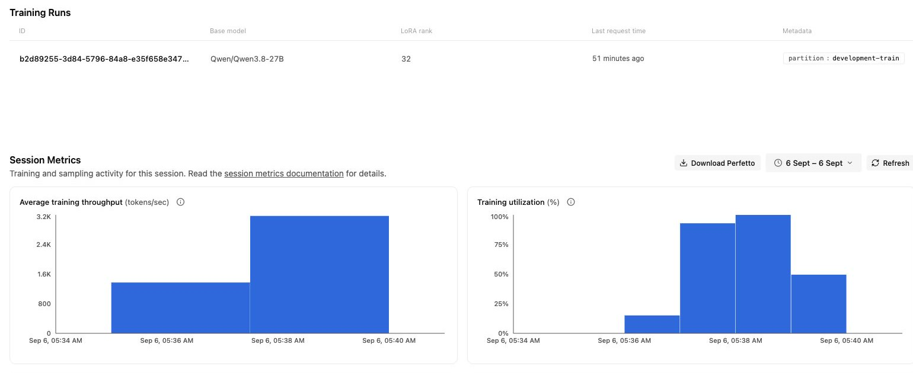
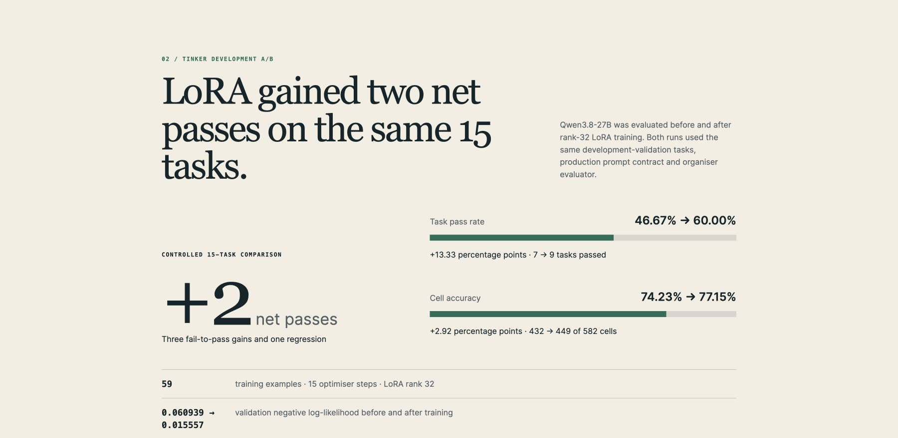
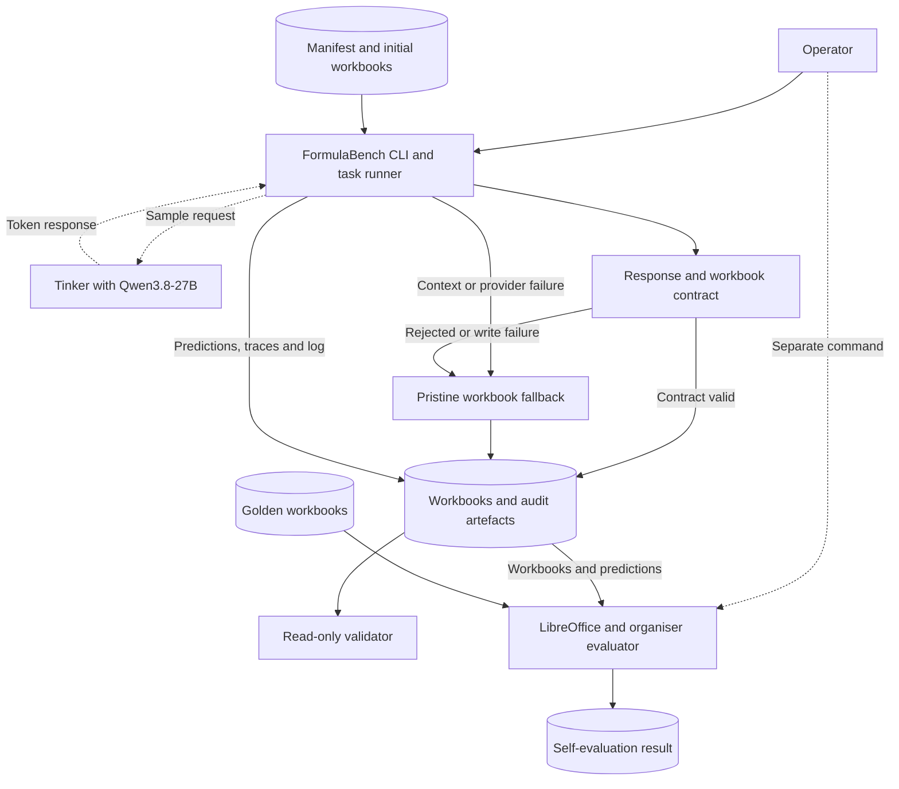

# FormulaBench


A reproducible, fail-closed pipeline for generating and validating Excel formulas.

[](https://github.com/MasteraSnackin/FormulaBench/actions/workflows/ci.yml)

[](SUBMISSION.md)

## Description

FormulaBench takes a plain-English spreadsheet instruction and an initial Excel workbook, then
attempts to produce the requested `.xlsx` workbook using `Qwen/Qwen3.8-27B` through Tinker. It
serves formula-generation researchers and spreadsheet analysts who need generated changes to
remain reviewable. It addresses model outputs that look plausible while missing required cells,
writing to the wrong sheet or introducing unsafe formulas.

The default runtime is now `formulabench.v2`, an **unscored parity candidate** backed by an exact
vendored copy of ExactSource. The vendor source is current at ExactSource commit
`99fe8084bf35a5fca6a2c2e1c9beae802766a618`; its inference core matches the ExactSource core that
was scored at commit `8b84dba1d9263e2123b8f15267239b70ff817907`. That source relationship is not a
FormulaBench v2 score. FormulaBench will make no same-or-better claim for v2 until a fresh run of
all 400 tasks has been evaluated. The original v1 code, artefacts and evidence remain intact and
are available through the explicit `--legacy-engine` route.

### V2 migration validation, not a benchmark score

The canonical dependency image completed a credential-free reconstruction of all 400 retained
ExactSource outcomes: 369 accepted plans were replayed, 31 safe fallbacks were checked byte for
byte, and zero workbook-content mismatches remained. For accepted plans it compares the exact set of
OOXML member names and each decompressed member payload after normalising only the core created and
modified values; ZIP container ordering and metadata are outside that comparison. The verifier
rebuilds each task's initial prompt and applies already-recorded plans; it does not call Tinker or
open golden workbooks. This establishes that the port preserves deterministic engine behaviour,
not that a new model run will produce identical answers.

The source implementation's separately published, hash-bound 400-task record scored 302/400
(75.50% pass rate) with 80.06% cell accuracy. Its coordinator ran for 6h 39m 36s, made 498 model
calls and reported 5,592,930 output tokens. These figures belong to ExactSource's run at
`8b84dba1d9263e2123b8f15267239b70ff817907`; they are not transferred to FormulaBench v2.
[The immutable upstream record](https://github.com/MasteraSnackin/ExactSource/blob/99fe8084bf35a5fca6a2c2e1c9beae802766a618/experiments/full_400_8b84dba.json)
contains the result, runtime, evaluator identity and artefact hashes.

| Evidence set | Passed tasks | Pass rate | Cell accuracy | FormulaBench v2 claim? |
| --- | ---: | ---: | ---: | --- |
| Historical FormulaBench v1 | 133/400 | 33.25% | 40.56% | No; retained baseline |
| Historical ExactSource source run | 302/400 | 75.50% | 80.06% | No; upstream evidence |
| FormulaBench v2 fresh 400-task run | Running; not yet evaluated | Not established | Not established | Unscored |

### Current FormulaBench v2 run

On 6 September 2026, v2 passed its canonical Docker preflight and a fresh paid task-`54513` canary
using `tinker:Qwen/Qwen3.8-27B`. The unchanged organiser evaluator graded the canary as a pass with
1/1 correct target cell. A new 400-task run then started at 10:46 BST with the fixed concurrency of
four and remains in progress. The active container records image ID
`sha256:48c490342713f5e5d5c1fc5625b20c22efdc650389685c5fe176d3a2e78a73ff`, adapter SHA-256
`4eb570d1455a6fd12a78569ef46d699b11c218bf2fa578c21d3c03d63719786c` and vendored ExactSource
tree SHA-256 `293c0958fcdbc86addff96fbc651a8463eb5577063a4a0d3cb5b406b1d16cf00`. Its adapter differs
from the current tree only in later startup credential validation and sampler-checkpoint error
messaging; its paid inference path is unchanged once a non-blank key is present. Later host-wrapper
and runtime-asset hardening is not part of that already-running container. Its pass rate and cell
accuracy will stay unpublished until all outputs complete and the organiser evaluator has scored
them. The running status is operational information, not benchmark evidence; this section must be
replaced with the hash-bound final result or an explicit failure record when the run ends.

Two fresh, paid development canaries then exercised both v2 execution routes with the unchanged
organiser evaluator and LibreOffice 26.8.0.3:

| Selected v2 canary | Route | Evaluator result | Target cells |
| --- | --- | ---: | ---: |
| `54513` | Typed operations | Pass | 1/1 |
| `23-24` | Restricted Python transform | Pass | 5,510/5,510 |

These two selected cases are diagnostic only and cannot estimate the 400-task pass rate. The
sanitised settings, timings and artefact hashes are recorded in
[`experiments/v2_migration_validation.json`](experiments/v2_migration_validation.json). The active
all-400 FormulaBench v2 result must still complete and be evaluated before making a same-or-better
score claim.

The historical v1 pipeline builds sheet-aware evidence, requests one structured model response, validates exact
target coverage and formula safety, then publishes either a validated edit or a pristine input
fallback. It retains one workbook and trace file per task, plus a prediction record in the shared
checkpoint manifest. A model attempt adds the prompt, any available parsed response, token counts,
latency and failure state to that trace.

This repository is the **Research Track: Excel Formula Generation (SpreadsheetBench)** entry for
the Encode x Ylookup Rebuild Private Markets Hackathon. The frozen v1 400-task result uses prompt
engineering and deterministic validation rather than fine-tuning. The repository now also contains
a separate, development-only Tinker LoRA experiment with a controlled 15-task validation result.
That small comparison is reported separately and does not replace or alter the frozen score below.

### Historical v1 public self-evaluation result

| SpreadsheetBench Verified v1 self-evaluation | Result |
| --- | ---: |
| Tasks graded | 400/400 |
| Tasks passed | 133/400 |
| Pass rate | 33.25% |
| Cell accuracy | 40.56% |
| Cell-level task pass rate | 32.73% |
| Sheet-level task pass rate | 34.40% |
| Missing tasks / evaluator errors | 0 / 0 |

The complete historical v1 self-evaluation result is in
[`submissions/formulabench/results.json`](submissions/formulabench/results.json), SHA-256
`c1e6fb6b540bb7272f4c537773e2a4826dd649d882c9b7fb549df9bccc66be0d`. A local run with the
organiser-supplied evaluator reported 133 passes from 400 tasks. The
[organiser's Research Track README](https://github.com/ylookup/encode-hackathon/blob/37d9016264762a25cae49e077cd0893055bd9093/research/README.md#L88)
lists a 59.0% one-shot, values-only Qwen3.8-27B reference. FormulaBench disables thinking,
prioritises formulas and applies a stricter fail-closed contract, so the results are not directly
comparable.

### Controlled Tinker LoRA validation result

FormulaBench also trained a rank-32 LoRA for `Qwen/Qwen3.8-27B` through Tinker on 59 development
examples whose labels passed FormulaBench's response and workbook contracts. The run completed all
15 optimiser steps and saved an indefinite sampler checkpoint. Development-validation NLL fell from
`0.060939` to `0.015557`, meaning that the checkpoint predicted those development labels better;
NLL is not a measure of spreadsheet correctness.



This provider-side capture from 6 September 2026 shows the model, LoRA rank, development-training
partition and non-zero training activity. The dashboard did not provide an
exact exported average for either throughput or utilisation, so no numerical rate is claimed. Those
charts show that training activity occurred; they do not measure workbook correctness.

For the controlled correctness comparison, the same 15 development-validation tasks were each run
once through the base model and checkpoint using identical production prompts, sampling settings,
parser, workbook writer and organiser evaluator.

| 15-task development-validation comparison | Base model | LoRA checkpoint | Change |
| --- | ---: | ---: | ---: |
| Tasks passed | 7/15 | 9/15 | +2 tasks |
| Pass rate | 46.67% | 60.00% | +13.33 pp |
| Correct target cells | 432/582 | 449/582 | +17 cells |
| Cell accuracy | 74.23% | 77.15% | +2.92 pp |
| Accepted predictions | 14/15 | 15/15 | +1 |
| Evaluator errors (not inference/write failures) | 0 | 0 | 0 |



This visual summarises the figures in the curated
[`experiments/tinker_lora_validation.json`](experiments/tinker_lora_validation.json); it is not a
second or independent evaluation. Three tasks changed from fail to pass, one changed from pass to
fail, and the remaining eleven kept their whole-task outcome. The base arm had one fail-closed
`workbook_write_failed` prediction; its unchanged fallback was still graded, while the checkpoint
arm accepted all 15 predictions.

The result was locally validated against prediction, trace and workbook hashes. It is
checkpoint-selection evidence, not a new 400-task benchmark score or proof of generalisation: the
split is small, drawn from the development bucket and used to select this checkpoint. Each arm uses
one sample per task, and six development examples whose targets exceed 500 cells were excluded before
the split. A broader post-freeze comparison is still required. Raw run directories and recalculated
evaluator workbooks are not committed, so the public JSON is a hash-recorded summary rather than a
self-contained or tamper-proof evidence pack.

### A pass and a near miss

| Evaluator outcome | Task | What FormulaBench had to do | What happened |
| --- | --- | --- | --- |
| Fully passed | [`54513`](submissions/formulabench/traces/54513.jsonl) | Calculate the price of a $34.99 item after a 55% discount. | FormulaBench wrote `=C8*(1-E8)` to `Sheet1!F8`. It calculated `15.7455`, displayed as `15.75`, and the evaluator marked the target cell correct. |
| Failed, but nearly complete | [`13-1`](submissions/formulabench/traces/13-1.jsonl) | Combine data from one sheet into another, merge duplicate rows by date and reference, sort the results and calculate totals. | FormulaBench completed 116 of 120 target cells correctly. Four amount cells were wrong, so the strict whole-task result was a failure. |

The four mismatches in task `13-1` were:

| Cell | Expected | FormulaBench produced |
| --- | ---: | ---: |
| `LISTS!D25` | 1,990 | 2,020 |
| `LISTS!D30` | 534 | 394 |
| `LISTS!D31` | 401 | 276 |
| `LISTS!D32` | 6,495 | 6,260 |

That task reached 96.67% cell accuracy, but the final total was among the four incorrect cells. The
whole task therefore failed. This is why FormulaBench evaluates the recalculated workbook rather
than treating a formula that runs as a correct answer.

### Judge resources

- [Submission overview](SUBMISSION.md)
- [System architecture](ARCHITECTURE.md)
- [Live research overview](https://masterasnackin.github.io/FormulaBench/)
- [Demo video](https://masterasnackin.github.io/FormulaBench/video.html)
- [Presentation viewer](https://masterasnackin.github.io/FormulaBench/presentation.html)
- [V2 migration validation evidence](experiments/v2_migration_validation.json)
- [V2 migration verifier](tools/verify_v2_parity.py)
- [Historical v1 self-evaluation results](submissions/formulabench/results.json)
- [Tinker LoRA validation evidence](experiments/tinker_lora_validation.json)
- [Tinker training session](https://tinker.thinkingmachines.ai/sessions/b2d89255-3d84-5796-84a8-e35f658e3470)
- [Historical v1 prediction manifest](submissions/formulabench/predictions.jsonl)
- [Historical v1 generated workbooks](submissions/formulabench/outputs/)
- [Historical v1 model traces](submissions/formulabench/traces/)
- [Evaluation and failure analysis](experiments/README.md)
- [Dataset and scaffold provenance](PROVENANCE.md)

## Table of Contents

- [Description](#description)
- [Features](#features)
- [Tech Stack](#tech-stack)
- [Architecture Overview](#architecture-overview)
- [Installation](#installation)
- [Usage](#usage)
- [Configuration](#configuration)
- [Screenshots / Demo](#screenshots--demo)
- [API / CLI Reference](#api--cli-reference)
- [Tests](#tests)
- [Roadmap](#roadmap)
- [Contributing](#contributing)
- [License](#license)
- [Contact / Support](#contact--support)

## Features

- Cell- and sheet-aware v2 routing with up to 48,000 characters of formula-aware workbook context.
- Typed spreadsheet operations that enforce TaskSpec answer-range containment, plan resource limits,
  formula safety and workbook-save constraints.
- A screened Python route for broad sheet transformations with separate reduced-capability and
  post-write checks; rejected work is replaced by a pristine input fallback.
- At most one bounded second call per task for semantic repair or initial-cell truncation recovery.
- Fresh-run ownership through a POSIX output-directory lock, private `0700` directories and `0600`
  artefacts, with unsafe filesystem entries rejected.
- A no-provider preflight and a credential-free all-400 migration verifier.
- A retained historical v1 engine with validated resume, explicit failure retry and
  credential-free replay of eligible stored responses.
- Read-only output validation with optional scanning for an explicitly configured secret value.
- A deterministic development-only SFT corpus, guarded LoRA trainer and completed checkpoint
  comparison with split, workbook, prompt, answer, prediction, trace and output hashes.
- A static evidence viewer for the retained result, demo video and presentation, deployable through
  GitHub Pages or Vercel.

## Tech Stack

| Area | Technology |
| --- | --- |
| Language | Python. The current container uses 3.12.11. `pyproject.toml` declares `>=3.11,<3.14`. |
| Workbook processing | `openpyxl==3.1.5` |
| Validation | Pydantic 2 |
| Inference | v2 uses the ExactSource HTTP transport; v1 uses Tinker SDK `0.27.1`. Both target `Qwen/Qwen3.8-27B`. |
| Optional training | Tinker Cookbook `0.5.7`, LoRA SFT and held-back development validation |
| Prompt rendering | v2 serialises ExactSource messages directly; historical v1 uses Transformers and Tokenizers. |
| Dependency management | `uv` with a committed lockfile |
| Evaluation | Organiser evaluator and LibreOffice Calc |
| Packaging and runtime | Hatchling and Docker |
| Tests and code quality | pytest and Ruff |
| Continuous integration | GitHub Actions on Ubuntu 24.04 |
| Evidence site | Static HTML, CSS and JavaScript in `docs/`, deployable through GitHub Pages or Vercel |
| Persistence | Local `.xlsx`, JSONL, JSON and log files. No database. |

## Architecture Overview



The default `formulabench.v2` adapter invokes the vendored ExactSource runner. It selects cell- or
sheet-level reasoning, builds up to 48,000 characters of workbook context, and asks Qwen for a
typed edit plan. Cell tasks use typed operations only; sheet tasks may use those operations or a
screened, restricted Python transform. A task receives at most one bounded second call: either an
ordinary semantic repair or the initial-cell truncation recovery, never both and never a third
call. See [ARCHITECTURE.md](ARCHITECTURE.md) for the route and sandbox boundaries.

The historical v1 `formulabench.capture` supervisor loads each task and builds formula-aware
workbook context. For tasks that reach the provider, the runner exchanges one logical sample with
Tinker, applies only responses that pass the contract and uses a pristine fallback for failures,
while the capture supervisor owns the process log. Complete runs validate automatically,
golden-aware scoring stays separate, and the read-only static viewer publishes frozen evidence
outside the inference path, as detailed in [ARCHITECTURE.md](ARCHITECTURE.md).

## Installation

### Requirements

- Git.
- Python 3.12.11 for parity with the current image. The project declares `>=3.11,<3.14`, matching
  the vendored engine's supported range, but CI does not test a multi-version matrix.
- [`uv`](https://docs.astral.sh/uv/).
- Docker for the submitted one-command runtime.
- LibreOffice Calc to rerun recalculation-based scoring locally. Exact parity across LibreOffice
  releases is not established.
- A Tinker account and API key for ordinary inference. v2 needs it for a paid fresh run, but not
  preflight. Historical v1 needs it except for preflight and eligible stored-response replay,
  including a fully completed resume. Tests and validation do not need it.

### Set up from scratch

```sh
git clone https://github.com/MasteraSnackin/FormulaBench.git
cd FormulaBench
uv sync --locked
uv run python data/download.py
```

On a fresh download, the script checks the SpreadsheetBench Verified archive against its pinned
SHA-256 before extraction. The dataset directory is intentionally excluded from Git.

Optional comparison environments are kept out of the production image:

```sh
# Organiser-style OpenRouter comparison dependencies
uv sync --locked --extra baseline

# Native Tinker Cookbook and checkpoint experiments
uv sync --locked --extra native-tinker
```

The optional native-Tinker environment installs additional XML and image libraries, so it is not
the canonical v2 workbook-serialisation environment. A direct v2 command fails before loading tasks,
creating output or calling Tinker when Pillow is installed or openpyxl is using `lxml`. Running
`uv sync --locked` restores the exact base environment; use the submitted Docker workflow for v2
score runs and migration-parity checks.

### Reproduce the safe Tinker training preflight

The training script rebuilds the frozen development-only corpus, verifies it independently,
tokenises all 74 eligible examples and prints the bounded plan. Its default mode makes zero Tinker
provider calls:

```sh
./scripts/run_training.sh
```

Paid training is a separate, explicit action requiring `--execute`, a writable Tinker project, a
local run directory and a key supplied privately through the environment. See the complete
[training protocol](training/README.md), including leakage boundaries, measured token counts,
validation NLL and production-parity checkpoint evaluation. The completed experiment improved the
15-task development-validation pass rate from 46.67% to 60.00% and cell accuracy from 74.23% to
77.15%. The separate evaluation script scored both arms with the organiser evaluator and emitted a
provenance-and-hash-bound comparison. It records accepted and failed predictions, rejects an
all-fallback arm, and does not present cell-accuracy deltas as comparable when evaluator errors
changed the denominator. The wrappers expose the API key only to paid trainer or inference
processes. Generated corpus and raw run directories remain ignored by Git; the curated result is in
[`experiments/tinker_lora_validation.json`](experiments/tinker_lora_validation.json) and does not
alter the retained 400-task submission evidence.

## Usage

### Run the current v2 Docker workflow

Export `TINKER_API_KEY` in your private shell rather than storing it in the repository. v2 does not
use `TINKER_PROJECT_ID`; that variable is needed only by some historical v1 or training workflows.
A fresh run requires an empty output directory and may make Tinker requests that consume credits or
incur cost.

```sh
export TINKER_API_KEY="$(python3 -c 'import getpass; print(getpass.getpass("Tinker API key: "))')"
./scripts/run_docker.sh \
  data/spreadsheetbench_verified_400 \
  submissions/my-run
```

The wrapper builds `formulabench:latest`, resolves both host paths and rejects them when they are
equal or either is inside the other. It then mounts the dataset read-only at `/data`, mounts the
selected output directory read-write at `/out`, and runs as the current host user. It owns those two
mount arguments, so they cannot be overridden through trailing CLI flags. v2 currently supports
fresh runs only; the output directory must be empty. It holds a POSIX advisory lock for the whole
run and keeps output directories at `0700` and regular artefacts at `0600`. The installed
environment, tokenizer cache, application packages and entry point are root-owned and
non-writable by either the default runtime identity or an arbitrary host UID.

Check the canonical v2 dependencies plus dataset loading and task selection without a credential or
provider call:

```sh
./scripts/run_docker.sh \
  data/spreadsheetbench_verified_400 \
  submissions/v2-preflight \
  --preflight-only
```

The wrapper creates the named output directory so Docker can mount it, but leaves it empty. It does
not pass `TINKER_API_KEY` or `TINKER_PROJECT_ID` into the preflight container. Preflight does not
exercise output locking, permission changes or writes.

### Run directly with Python instead

Use the exact base dependency environment (`uv sync --locked`) before running v2 directly. The
command deliberately rejects the optional native-Tinker dependency surface because it changes
openpyxl workbook serialisation.

```sh
uv run python -m formulabench.v2 \
  --dataset-dir=data/spreadsheetbench_verified_400 \
  --out-dir=submissions/my-python-run
```

Use a known development task for a bounded canary:

```sh
uv run python -m formulabench.v2 \
  --dataset-dir=data/spreadsheetbench_verified_400 \
  --out-dir=submissions/canary-54513 \
  --ids=54513
```

### Verify the ExactSource migration without a model call

With the ExactSource repository checked out next to FormulaBench, the following command builds the
canonical test image, disables container networking, rebuilds all 400 initial prompts, replays the
retained accepted plans, and checks every fallback without reading golden workbooks:

```sh
./scripts/verify_v2_migration.sh \
  data/spreadsheetbench_verified_400 \
  ../ExactSource
```

The recorded migration run reported `checked=400 accepted=369 fallback=31 mismatches=0`. This is a
source-and-execution parity check, not an evaluator score and not a substitute for a fresh model
run.

### Run the historical v1 engine, resume or retry

Pass `--legacy-engine` to select the retained v1 adapter explicitly:

```sh
./scripts/run_docker.sh \
  data/spreadsheetbench_verified_400 \
  submissions/my-v1-run \
  --legacy-engine
```

Resume, retry and stored-response replay are v1-only operations and therefore require
`--legacy-engine`. Ordinary resume reuses only validated checkpoints and does not retry recorded
failures:

```sh
./scripts/run_docker.sh \
  data/spreadsheetbench_verified_400 \
  submissions/my-run \
  --legacy-engine \
  --resume
```

Reschedule validated failures only when another inference attempt is intentional. A task consumes
credits or incurs cost only if it reaches the provider:

```sh
./scripts/run_docker.sh \
  data/spreadsheetbench_verified_400 \
  submissions/my-run \
  --legacy-engine \
  --resume \
  --retry-failures
```

Replay eligible stored `workbook_write_failed` responses after a contract repair, without a
credential or provider call:

```sh
./scripts/run_docker.sh \
  data/spreadsheetbench_verified_400 \
  submissions/my-run \
  --legacy-engine \
  --resume \
  --replay-write-failures
```

`--retry-failures` and `--replay-write-failures` are mutually exclusive.

### Validate and score outputs

A completed v2 run validates its own prediction, trace and workbook contract before writing
`run_metrics.json`. For a complete all-400 run, the read-only FormulaBench validator can
independently recheck it and scan for the configured credential by using v2's provider-qualified
model identifier:

```sh
uv run python -m formulabench.validate_out \
  --dataset-dir=data/spreadsheetbench_verified_400 \
  --out-dir=submissions/my-run \
  --expected-model=tinker:Qwen/Qwen3.8-27B \
  --secret-env=TINKER_API_KEY

uv run python evaluate.py \
  --predictions=submissions/my-run/predictions.jsonl \
  --all \
  --out=submissions/my-run-results.json
```

For a historical v1 run, use `--expected-model=Qwen/Qwen3.8-27B` instead. Keep evaluator results
outside the inference output root: this preserves a clean evidence boundary, and v1's resume
allow-list rejects additional root files such as `results.json`.

A completed v2 output directory has this layout:

```text
submissions/my-run/
├── predictions.jsonl
├── run.log
├── run_metrics.json
├── outputs/
│   └── <task-id>.xlsx
└── traces/
    └── <task-id>.jsonl
```

Historical v1 uses the same paths except `run_metrics.json`.

## Configuration

### Production and evaluation environment variables

| Variable | Required | Purpose |
| --- | --- | --- |
| `TINKER_API_KEY` | Docker wrapper except preflight and legacy replay. Direct CLI when inference is pending. | Authenticates Tinker requests. |
| `TINKER_PROJECT_ID` | Legacy v1, account-dependent | Selects a writable project for the native v1 client when the account default is read-only. |
| `FORMULABENCH_IMAGE` | No | Overrides the Docker image name used by `scripts/run_docker.sh`. |
| `SOFFICE` | No | Selects the LibreOffice executable used only by the separate evaluator. |

Do not commit credentials. Historical v1 disables Tinker SDK telemetry before client construction;
the shared container also sets the telemetry-disable environment switch. v2 uses its direct HTTP
transport rather than the SDK client.

### V2 safety boundary

The sheet-level Python route is restricted with AST screening, reduced built-ins, allow-listed
helpers and environment variables, a temporary workbook copy, and time and resource limits. Its
post-write controls check changed formulas, formula metadata and cell hyperlinks, output size and
readability, and the continued existence of required answer sheets. Unlike typed operations, this
route does not enforce TaskSpec answer-range containment or general workbook-structure
preservation. It is a defence-in-depth benchmark control, not a hardened general-purpose code
sandbox: the child still runs as the coordinator's unprivileged container UID, and the inference
container needs network access for Tinker. Use stronger OS-level isolation and an approved
data-handling policy before applying it to confidential workbooks.

### Fixed v2 inference settings

| Setting | Value |
| --- | --- |
| Model | `Qwen/Qwen3.8-27B` |
| Temperature | `0.0` |
| Workbook context | Up to `48,000` characters |
| Cell route | Typed operations only |
| Sheet route | Typed operations or screened, restricted Python |
| Reasoning | Requested for initial calls and ordinary semantic repair |
| Cell initial output cap | `16,000` tokens |
| Cell truncation-recovery cap | `32,000` tokens |
| Sheet initial and semantic-repair cap | `32,000` tokens |
| Second-call allowance | At most one: semantic repair or bounded initial-cell truncation recovery |
| HTTP transport retries | Up to 2 qualifying transient retries within each logical call |
| HTTP timeouts | Connect 20s; stream read 300s; write 30s; pool 30s |

The second-call allowance counts logical completions, not individual HTTP attempts. These settings
describe the unscored v2 parity candidate; they must not be read as results.

### Historical v1 inference settings

| Setting | Value |
| --- | --- |
| Model | `Qwen/Qwen3.8-27B` |
| Transport | Native Tinker sampling client |
| Renderer | Pinned Qwen3.8 thinking-disabled chat template |
| Tokenizer revision | `1d4bf0f2ff6012fd82039f2fa52739d0dd7c60c0` |
| Thinking | Disabled |
| Temperature | `0` |
| Samples per task attempt | `1` |
| Maximum output tokens | `8,192` |
| Maximum authored prompt | `20,000` characters |
| Provider HTTP retries | `0` |
| Default maximum sampling concurrency | `4` |

Historical v1 model settings are centralised in [`formulabench/constants.py`](formulabench/constants.py)
and are not exposed as CLI overrides. The application and runtime dependency resolution is locked
in [`uv.lock`](uv.lock). [`Dockerfile`](Dockerfile) defines the container build and runtime.

Each attempt that reaches the provider requests one logical sample and disables FormulaBench's own
HTTP and sampling retries. The Tinker SDK may still retry idempotent submission or retrieval
operations for that same sample.

## Screenshots / Demo

The FormulaBench inference engine is CLI-based. Its hosted demo is a read-only evidence viewer, not
an inference interface. These panels are built from the retained workbook, process log and result
from the organiser-supplied evaluator, without making a fresh model call.

### Generated workbook


Task `54513` produced `=C8*(1-E8)` in `Sheet1!F8`. The retained workbook displays `15.75`, and the
organiser-supplied evaluator marked its single target cell correct.

### Complete public run


The panel combines exact excerpts from `submissions/formulabench/run.log` with figures derived from
`submissions/formulabench/results.json`. It records the historical v1 400-task run,
credential-free replay and final 33.25% task pass rate. The replay made no additional provider
calls.

### Demo and presentation

- [Open the live research overview](https://masterasnackin.github.io/FormulaBench/).
- [Watch the 75-second FormulaBench v2 explainer](https://masterasnackin.github.io/FormulaBench/video.html),
  which covers bounded context, the two execution routes, pristine fallback and target-cell
  evaluation while keeping migration parity separate from benchmark accuracy.
- [Watch the 30.3-second privacy-safe Tinker evidence clip](https://masterasnackin.github.io/FormulaBench/video.html#tinker-evidence-video),
  built from the sanitised provider capture and the controlled A/B summary rather than a recording
  of the authenticated browser session.
- [View the eleven-slide presentation](https://masterasnackin.github.io/FormulaBench/presentation.html),
  [open the PDF](presentation/FormulaBench-Hackathon-Deck.pdf), or
  [download the PowerPoint source](presentation/FormulaBench-Hackathon-Deck.pptx).

The evidence surface is static whether served by GitHub Pages or Vercel. It cannot upload a
workbook or invoke Tinker.

### Deploy the evidence site to Vercel

The repository-level [`vercel.json`](vercel.json) skips a build step and serves `docs/` as the
deployment output. From an authenticated Vercel CLI session, publish the current repository with:

```sh
npx --yes vercel@latest deploy --prod --yes
```

For a temporary claimable deployment without a local login, use `--temporary` instead of `--prod`.
Do not pass provider or spreadsheet credentials to this static deployment.

<details>
<summary>Accessible run transcript</summary>

```text
# Initial run
FormulaBench  model=Qwen/Qwen3.8-27B  tasks=400  remaining=400  concurrency=4
completed  ok=350  failed=50
output validation  ok=True  issues=0  workbooks=400/400

# Stored-response replay and final validation
stored-response replay  eligible=7  replayed=4  unchanged=3  additional_model_calls=0
completed  ok=354  failed=46
output validation  ok=True  issues=0  workbooks=400/400
```

</details>

## API / CLI Reference

FormulaBench exposes a CLI rather than an HTTP API. Display the full local reference with:

```sh
uv run python -m formulabench.v2 --help
```

| Argument | Behaviour |
| --- | --- |
| `--dataset-dir PATH` | Required SpreadsheetBench dataset directory. |
| `--out-dir PATH` | Required empty output directory for v2. |
| `--ids ID[,ID...]` | Restricts execution to validated task IDs. |
| `--concurrency 4` | Confirms the fixed ExactSource-parity concurrency. Other values fail before inference. |
| `--preflight-only` | Validates the selected runtime without sampling the model. |
| `--legacy-engine` | Selects the retained v1 capture engine. |

The following options are accepted only with `--legacy-engine`:

| Historical v1 argument | Behaviour |
| --- | --- |
| `--resume` | Validates and continues an existing output directory. |
| `--retry-failures` | With `--resume`, reschedules failed checkpoints and may make new provider calls. |
| `--replay-write-failures` | With `--resume`, reuses eligible stored responses with zero model calls. |

The v2/capture supervision path does not expose the historical sampler-checkpoint option. Sampler
checkpoint experiments require direct `uv run python -m formulabench.cli` use outside that
supervision boundary; run `uv run python -m formulabench.cli --help` for the direct legacy options.

There is no declared stable Python library API. Internal modules and formats may change until the
project adopts a versioned public interface.

## Tests

Run the credential-free local checks:

```sh
uv run pytest
uv run ruff check exactsource formulabench tests tools experiments training baseline/tinker_predict.py
uv run ruff format --check exactsource formulabench tests tools experiments training baseline/tinker_predict.py
uv run python evaluate.py --oracle
```

Build the same container targets used by CI:

```sh
docker build --target contract-test -t formulabench:contract-test .
docker build --target runtime -t formulabench:latest .
```

GitHub Actions also downloads the checksum-verified public dataset and verifies the all-400 target
contracts and frozen split. See the [current workflow](https://github.com/MasteraSnackin/FormulaBench/actions/workflows/ci.yml).

## Roadmap

These are proposed improvements, not claims about either benchmark result:

- Complete and evaluate the active all-400 v2 batch, then publish its result with immutable hashes.
- Add restart-safe v2 checkpoints and explicit, provenance-checked failure retry.
- Give generated Python a separate UID or disposable networkless worker boundary.
- Expand deterministic operations for transformations that still require generated Python.
- Improve and measure task-aware retrieval on a frozen development partition.
- Recalculate candidates in an isolated LibreOffice process and reject runtime formula errors
  before publication.
- Add formula compatibility normalisation and output invariants.
- Generate and verify the hosted evidence metrics from the hashed evaluation result during
  deployment.
- Keep the LoRA checkpoint and inference configuration frozen, then make a broader comparison on
  the historically named `held_out` and `final_only` reporting buckets.

See [`experiments/README.md`](experiments/README.md) for the failure analysis behind the retrieval,
task-routing, deterministic-operation and controlled-comparison priorities.

## Contributing

Use [GitHub Issues](https://github.com/MasteraSnackin/FormulaBench/issues) to report a defect, propose
an experiment or discuss a change. GitHub sign-in is required. The repository does not yet declare
code-contribution terms, so agree the scope with the maintainer before preparing a pull request.
Do not copy, modify or redistribute code unless the relevant rights holders have granted permission.

Never commit API keys, private workbooks, the downloaded dataset or unredacted provider data.
Any authorised change must preserve fail-closed writes, deterministic artefacts and an honest
separation between development evidence and unseen private evaluation.

## License

This repository does not currently declare a project code licence and contains no `LICENSE` file.
Do not assume permission to reuse, modify or redistribute the project code. The public dataset is
separately identified by the organisers as CC BY-SA 4.0, and the referenced Qwen model declares
Apache-2.0. Neither grants a licence for FormulaBench itself. See [PROVENANCE.md](PROVENANCE.md) for
the recorded upstream, dataset and model boundaries.

## Contact / Support

- Repository owner and declared team member: [MasteraSnackin](https://github.com/MasteraSnackin)
- Bug reports and research proposals: [GitHub Issues](https://github.com/MasteraSnackin/FormulaBench/issues)
- Repository: [github.com/MasteraSnackin/FormulaBench](https://github.com/MasteraSnackin/FormulaBench)

No public support email or service-level commitment is declared.
