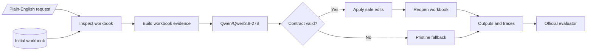

# FormulaBench

[](https://github.com/MasteraSnackin/FormulaBench/actions/workflows/ci.yml)

FormulaBench turns a plain-English spreadsheet instruction and an initial workbook into a
completed Excel workbook using `Qwen/Qwen3.8-27B`. Before it writes anything, it checks the exact
worksheets and cells requested, validates the model's structured answer and rejects incomplete or
unsafe edits.

This is our **Research / Track 2** entry for the Encode x Ylookup Rebuild Private Markets
Hackathon. It uses prompt engineering and a deterministic workbook pipeline rather than
fine-tuning. Evaluation follows the official
[SpreadsheetBench Verified](https://huggingface.co/datasets/KAKA22/SpreadsheetBench) evaluation
contract.

## Result at a glance

| Public evaluation | Result |
| --- | ---: |
| Tasks graded | 400/400 |
| Tasks passed | 133/400 |
| Pass rate | 33.25% |
| Cell accuracy | 40.56% |
| Missing tasks / evaluator errors | 0 / 0 |

The score is below the organiser's reported approximately 59% reference. The inference settings
and output contracts differ, so this result describes the frozen FormulaBench configuration. It
is not a controlled comparison with the organiser's run.

## Judge links

- [Submission overview](SUBMISSION.md)
- [Official 400-task evaluation results](submissions/formulabench/results.json)
- [Prediction manifest](submissions/formulabench/predictions.jsonl)
- [Generated workbook outputs](submissions/formulabench/outputs/)
- [Complete model traces](submissions/formulabench/traces/)
- [Dataset and scaffold provenance](PROVENANCE.md)
- [Passing GitHub checks](https://github.com/MasteraSnackin/FormulaBench/actions/runs/33991876175)

## How a task moves through FormulaBench



## Quick start

Download the dataset, provide `TINKER_API_KEY` through the environment and run:

```sh
./scripts/run_docker.sh
```

The script stops if the dataset or credential is missing. A fresh run requires an empty output
directory. Resume mode validates each checkpoint before reuse, while stored-response replay does
not need a credential. None of these modes deletes previous results.

## Why this approach

The supplied one-shot baseline gives the model a value-only crop of the first 120 rows and
30 columns, then identifies returned cells by coordinate alone. That loses existing formulas,
omits relevant regions in larger workbooks and allows cells on different sheets to collide.
Large sheet-level answers can also exceed a practical cell-by-cell JSON response.

FormulaBench starts with the measurable failures:

1. **Exact targets.** Every response cell includes its worksheet and A1 address. Missing,
   duplicate and out-of-range cells are rejected before the workbook is changed.
2. **Relevant evidence.** The serializer combines formula and cached-value views, resolves a
   uniquely instruction-named source sheet when metadata leaves it unqualified, represents
   complete small answer and data ranges as compact rows, samples larger sheets spatially and
   stays within a strict character budget. Answer templates are packed first because the first
   harder canary exposed target omissions despite complete source coverage.
3. **Complete, typed outputs.** Finite targets are complete partitions: unchanged cells and blanks
   must be returned explicitly or covered by a finite `preserve_ranges` entry. Large rectangular
   answers can use one range fill, and dates and datetimes use strict native Excel value objects
   rather than locale-dependent text. Formula references are translated with Excel copy semantics;
   overlaps, omissions and outside cells reject the whole response.
4. **Safe writes.** A static gate rejects explicit external workbook/path/URI references, DDE and
   high-risk external-data, executable or link functions before any model-authored formula is
   written. A successful response is applied atomically to a fresh copy of the initial workbook
   and reopened before publication. Any failure produces a byte-identical copy of that initial
   workbook.
5. **Auditable, resumable runs.** Each completed task is checkpointed immediately with a
   workbook, prediction record and trace containing the authored task prompt, extracted
   structured answer, token counts, latency and failure codes. A separate validator checks the
   submission structure, paths, workbooks and trace schema.

The current release uses one logical model sample per task attempt, no FormulaBench-level
automatic retry and no arbitrary model-written Python. Compatibility-endpoint probes established
that this model/endpoint combination could not reliably provide a complete structured answer with
thinking disabled. FormulaBench therefore uses the native Tinker sampling client with a pinned
Qwen3.8 chat template that is token-for-token identical to the official thinking-disabled
renderer for the production prompt. The complete sanitised transport history is retained in
[`experiments/live_preflight.json`](experiments/live_preflight.json).

After a writable project was selected through `TINKER_PROJECT_ID`, the first native canary
completed development task `54513` in 4,730 ms using 6,808 input tokens and 57 output tokens. Its
single terminal Qwen tool call wrote `=C8*(1-E8)` to `Sheet1!F8`; LibreOffice recalculation and the
supplied evaluator returned 1/1 correct cells, 100% pass rate and 100% cell accuracy. The exact
value is 15.7455 and its existing two-decimal format displays 15.75; the golden formula rounds
internally to 15.75, and the supplied evaluator normalises both to two decimals.

The initial harder canary on development task `13-1` returned only 72 of 120 required cells. The
contract rejected the response for `missing_cells` and published a byte-identical copy of the
initial workbook. That fallback scored 82/120 cells, `pass_rate=0.0` and `cell_accuracy=0.6833`;
the 82 correct cells are the untouched-template signature, not partially applied model work. This
run also verified the Tinker shutdown repair: no pending background-poller warning remained. Its
failure analysis led to complete compact answer rows, strict typed Excel dates/datetimes, explicit
preservation ranges and stronger aggregation instructions.

The separate revised `13-1` canary then produced a complete, contract-valid answer with all 120
cells explicit. It used 6,982 input tokens and 3,113 output tokens in 70,499 ms. The supplied
evaluator, including LibreOffice recalculation, scored 116/120 cells and
`cell_accuracy=0.9667`. Its `pass_rate` remains `0.0`: four amount cells in the final grouped
section were arithmetically wrong, including the resulting total. This is a substantial
development improvement, not a task pass and not a complete benchmark result. The sanitised
request and result, including the local artefact hashes, are recorded in
[`experiments/live_preflight.json`](experiments/live_preflight.json). No unrun ablation is
presented as evidence.

The complete 400-task run is now retained in `submissions/formulabench/`. The first pass accepted
350 model responses and failed closed on 50. A later credential-free replay revalidated the seven
stored responses that had reached workbook writing under the corrected exact round-trip contract;
four were published successfully, three remained strict failures and no additional model call was
made. The final materialisation therefore contains 354 accepted workbooks and 46 pristine input
fallbacks. The organiser's evaluator, after LibreOffice recalculation, graded all 400 tasks with
zero missing items and zero evaluator errors: 133 tasks passed, for `pass_rate=0.3325` and
`cell_accuracy=0.4056`. Cell-level task pass rate is `0.3273`; sheet-level task pass rate is
`0.3440`.

This is below the organiser's reported approximately 59% Qwen3.8-27B baseline. It is not an
apples-to-apples reproduction: the organiser path uses the model's recommended
`qwen3_8_xhigh_reasoning` renderer and asks for final values, whereas this submission disables
thinking, prioritises live formulas and enforces exact target coverage plus stricter fail-closed
workbook checks. The difference explains why the public score should not be presented as a
baseline improvement; it does not prove which individual design choice caused the gap.

Before the first credentialled model run, the 400 public tasks were frozen into deterministic,
stratified 80-task development, 80-task validation and 240-task final-reporting buckets. The file
retains the original `held_out` and `final_only` field names. The strata use instruction type and
an initial-workbook-resolved target-size proxy. See
[`experiments/public_split.json`](experiments/public_split.json) and the reproducible procedure in
[`experiments/README.md`](experiments/README.md). The split records hashes for the manifest and
the exact initial-workbook bytes used to derive it. A later mechanical aggregate audit opened all
400 public golden workbooks to measure benchmark-wide structural properties; its aggregate-only
output is [`experiments/public_benchmark_audit.json`](experiments/public_benchmark_audit.json).
No task-specific golden value outside development was copied into training, prompts, runtime or
task-specific logic, but aggregate findings informed the general contract design. The public
buckets are therefore transparent reporting partitions, not statistically untouched holdouts.
Only the organiser's private evaluation remains genuinely unseen.

The save/reopen preservation contract was also exercised against every eligible public initial
workbook without consulting a golden workbook: 397/397 writes succeeded (396 finite targets and
the one eligible dynamic target), with zero semantic signature mismatches across 297,184
inspected target cells. Three targets that require creating a new sheet reject preservation by
design. The comparison accepts only known openpyxl round-trip normalisations for numeric
serialisation, blank encodings and an all-zero style; formulas, formats, links and comments remain
exact.

## Fixed inference configuration

- Provider: Tinker
- Model: `Qwen/Qwen3.8-27B`
- Transport: native Tinker `SamplingClient`, one non-streaming token sample
- Renderer: pinned Qwen3.8 Hugging Face chat template at revision
  `1d4bf0f2ff6012fd82039f2fa52739d0dd7c60c0`
- Thinking: disabled by the generation template with `enable_thinking=False`
- Reasoning effort: omitted; the disabled-thinking template injects no effort instruction
- Temperature: `0`
- Samples per task attempt: `1`
- Configured retries: Tinker HTTP-client retries `0` and sampling retry wrapper disabled; the SDK
  may still retry idempotent internal submission or retrieval operations for that same sample
- SDK telemetry: forced off in code before any client construction and in the container environment;
  an inherited setting cannot re-enable it or copy credential headers into error telemetry
- Structured response: one `submit_spreadsheet_answer` schema rendered into the model prompt and
  enforced by a strict terminal XML parser; complete strict JSON is the only fallback
- Credential environment variable: `TINKER_API_KEY`
- Optional project selector: `TINKER_PROJECT_ID`; required when the account's Default project is
  read-only and another writable project is available

The model, renderer revision, disabled-thinking policy, temperature, sample count, configured
retry policy, telemetry policy and tool contract cannot be overridden through the production command line. Native
responses do not echo a model id, so traces identify it honestly as the configured base model.
FormulaBench requires the expected stop reason, exactly one terminal `<|im_end|>` token and one
whole-response answer tool call. It rejects prose, fences, malformed or multiple calls, duplicate
JSON keys, non-finite numbers, missing cells and out-of-range content.

## Set up

Requirements:

- Python 3.11
- [`uv`](https://docs.astral.sh/uv/)
- LibreOffice for local scoring
- Docker for the submitted runtime

Install the locked production and development dependencies:

```sh
uv sync --locked
```

The organiser's Tinker Cookbook baseline source remains available through the optional
`native-tinker` dependency group. It uses the official [Tinker
Cookbook](https://github.com/thinking-machines-lab/tinker-cookbook), but that package is not
installed in the production image because FormulaBench's lean native adapter needs only the
tokenizer chat template and remote sampling SDK, not the cookbook's training and PyTorch stack.

```sh
uv sync --locked --extra native-tinker
```

That optional environment supports two controlled experiments without changing the submitted
runner: a native base-model comparison using [Tinker Cookbook's Qwen3.8
renderer](https://github.com/thinking-machines-lab/tinker-cookbook/blob/main/tinker_cookbook/renderers/qwen3_8.py),
and sampling from a fine-tuned `tinker://...` checkpoint. The renderer defaults to the cookbook's
model recommendation, but can be fixed explicitly for an ablation. For example, a single
development task is:

```sh
uv run baseline/tinker_predict.py \
  --out-dir=submissions/native-qwen3.8-canary \
  --base-model=Qwen/Qwen3.8-27B \
  --renderer=qwen3_8_xhigh_reasoning \
  --ids=54513
```

This comparison is not the FormulaBench submission path and is not reported as a benchmark score.
Any supervised or reinforcement-learning experiment must use development examples only. Public
validation and final-reporting buckets remain useful for transparent comparison, but only the
organiser's private evaluation is a statistically unseen result.

The OpenRouter comparison baseline uses `uv sync --locked --extra baseline`.

Download and verify the public dataset:

```sh
uv run python data/download.py
```

Run the credential-free checks:

```sh
uv run pytest
uv run ruff check formulabench tests experiments baseline/tinker_predict.py
uv run ruff format --check formulabench tests experiments baseline/tinker_predict.py
uv run python evaluate.py --oracle
```

The same unit, formatting, wheel and container gates run in GitHub Actions without provider
credentials. A separate checksum-backed integration job downloads the public dataset and runs
the all-400 target-contract checks.

## Run

Create an empty output directory and supply `TINKER_API_KEY` through the environment. If the
account's Default project is read-only, also supply the ID of a known writable project as
`TINKER_PROJECT_ID`. Do not put the key in this repository.

```sh
uv run python -m formulabench.capture \
  --dataset-dir=data/spreadsheetbench_verified_400 \
  --out-dir=submissions/formulabench
```

For a local transport canary, add `--ids=54513`; it is in the frozen development bucket. Task
`13-1` is the harder multi-sheet context regression: its initial attempt failed exact coverage
and its separately retained revised attempt reached 116/120 cells, but did not pass the task.
Partial runs are deliberately not reported as full benchmark results.

Every completed task updates `predictions.jsonl` atomically. To continue an interrupted run,
use the same dataset, output directory and task selection with an explicit resume flag:

```sh
uv run python -m formulabench.capture \
  --dataset-dir=data/spreadsheetbench_verified_400 \
  --out-dir=submissions/formulabench \
  --resume
```

Before skipping a task, resume mode validates its prediction record, canonical paths, workbook,
trace and failure fallback. An uncheckpointed output or trace is reported as an orphan and left
untouched for inspection.

Ordinary resume also preserves failed checkpoints and does not silently spend another model call.
To deliberately retry only validated failures, add the explicit retry flag:

```sh
uv run python -m formulabench.capture \
  --dataset-dir=data/spreadsheetbench_verified_400 \
  --out-dir=submissions/formulabench \
  --resume \
  --retry-failures
```

Each failed task is staged separately and transactionally replaces its earlier workbook, trace
and prediction only after the new result is complete. If publication is interrupted, the next
ordinary resume finishes the local recovery without another provider call.

If a contract-only write repair makes a previously retained response valid, replay only those
eligible stored responses without a credential or another provider call:

```sh
./scripts/run_docker.sh \
  data/spreadsheetbench_verified_400 \
  submissions/formulabench \
  --resume \
  --replay-write-failures
```

Replay is deliberately narrower than retry. It accepts only checkpoints whose exact failure code
is `workbook_write_failed`, verifies the task input, trace and stored response hashes, and records
the source trace and `additional_model_calls=0` in the replacement trace. It is mutually exclusive
with `--retry-failures`. The completed public run replayed four of seven eligible checkpoints;
three responses containing authored empty strings remained strict write failures.

The output directory contains:

```text
predictions.jsonl
outputs/<task-id>.xlsx
traces/<task-id>.jsonl
run.log
```

## Docker

The image uses immutable multi-architecture base-image digests and runs as a non-root user. During
the build it fetches only the tokenizer/template files at the pinned Qwen revision, verifies all
four SHA-256 values and stores them for offline runtime use. It contains neither PyTorch nor the
Tinker Cookbook.

Run the credential-free container tests:

```sh
docker build --target contract-test -t formulabench:contract-test .
```

Build the production image:

```sh
docker build --target runtime -t formulabench:latest .
```

The one-command wrapper accepts the dataset directory, output directory and then any runner
arguments. For example, resume the default full run with:

```sh
./scripts/run_docker.sh \
  data/spreadsheetbench_verified_400 \
  submissions/formulabench \
  --resume
```

Run it with the dataset mounted read-only and an empty writable output directory:

```sh
docker run --rm \
  --user "$(id -u):$(id -g)" \
  --env TINKER_API_KEY \
  --env TINKER_PROJECT_ID \
  --mount type=bind,src=/absolute/path/to/dataset,dst=/data,readonly \
  --mount type=bind,src=/absolute/path/to/empty-output,dst=/out \
  formulabench:latest
```

To run a credential-free container preflight, keep both mount arguments and append
`--preflight-only`:

```sh
docker run --rm \
  --user "$(id -u):$(id -g)" \
  --mount type=bind,src=/absolute/path/to/dataset,dst=/data,readonly \
  --mount type=bind,src=/absolute/path/to/empty-output,dst=/out \
  formulabench:latest --preflight-only
```

## Score

Use only the organiser's evaluator for reported results:

```sh
uv run python evaluate.py \
  --predictions=submissions/formulabench/predictions.jsonl \
  --all \
  --out=submissions/formulabench/results.json
```

The ranking metric is `pass_rate`: a task passes only when every graded cell is correct after
LibreOffice recalculation. `cell_accuracy` is the tie-break.

The retained all-400 result was produced with LibreOffice `7.4.7.2` in an isolated container with
network access disabled, a read-only root filesystem, all Linux capabilities dropped and no host
credentials. Its complete organiser-evaluator summary is:

| Metric | Result |
| --- | ---: |
| Tasks graded | 400/400 |
| Evaluator errors / missing tasks | 0 / 0 |
| Tasks passed | 133/400 |
| Pass rate | 33.25% |
| Cell accuracy | 40.56% |
| Cell-level task pass rate | 32.73% |
| Sheet-level task pass rate | 34.40% |

The result file is
[`submissions/formulabench/results.json`](submissions/formulabench/results.json), SHA-256
`c1e6fb6b540bb7272f4c537773e2a4826dd649d882c9b7fb549df9bccc66be0d`. Before recalculation, a
uniform static comparison found 31,240 authored or changed formulas and no newly introduced
formula-gate, defined-name, macro, connection, sensitive-part or external-relationship problem.
The supplied inputs already contained 92 sensitive OOXML parts and 153 external relationships;
those inherited features are why recalculation was isolated rather than treated as safe host
content.

## Repository structure

```text
formulabench/
  artifacts.py       dataset and output path safety
  capture.py         unedited stdout/stderr capture
  cli.py             fixed production entry point
  context.py         bounded formula-aware workbook evidence
  contract.py        target parsing, response validation and atomic writes
  provider.py        fixed Tinker model adapter
  replay.py          verified credential-free stored-response replay
  runner.py          task orchestration
  validate_out.py    read-only submission validator
tests/               credential-free synthetic and integration tests
scripts/run_docker.sh one-command production container run
experiments/          reproducible input-only and aggregate public benchmark audits
baseline/            organiser-supplied comparison baseline
evaluate.py          organiser-supplied evaluator
sb.py                organiser-supplied benchmark utilities
```

## Current limits

- A whole-column answer has no final row count in its metadata. FormulaBench matches the shipped
  evaluator by requiring dense coverage through the larger of the initial worksheet extent and
  the model's projected output extent, but only the instruction can determine a still-larger
  correct final extent.
- Cached formula values may be absent or stale. Formula text is treated as structure and cached
  values only as evidence.
- LibreOffice and Excel do not implement every modern or dynamic-array formula identically.
- The native Tinker SDK may wait for model capacity and may retry idempotent internal submission or
  retrieval operations even though HTTP-client retries and the sampling resampling wrapper are
  configured off. FormulaBench still requests one logical sample per task attempt. A failed task
  is checkpointed and is attempted again only through the explicit `--retry-failures` workflow.
- A hard interruption can occur after a workbook and trace are written but before their
  prediction checkpoint. Resume mode fails closed on those orphan files and leaves them in
  place; an operator must inspect and resolve that directory rather than silently reusing it.
- The output contract can write ordinary formulas and modern spill anchors, but it cannot create
  a legacy Ctrl+Shift+Enter array-formula range.
- Generated formulas are active, untrusted workbook content. The static gate blocks explicit
  external references and high-risk functions, but it is not an Excel sandbox: dynamically
  constructed references, defined names, add-ins and pre-existing workbook connections need an
  isolated recalculation environment without network access or host credentials. The hackathon
  run is restricted to the supplied anonymised dataset.
- openpyxl can remove unsupported worksheet-level Data Validation extensions. This warning occurs
  in four public initial workbooks and did not affect their graded target cells, but FormulaBench
  does not claim byte-for-byte preservation of every arbitrary workbook feature after a
  successful edit.
- The complete public score is lower than the organiser's reported baseline. Because renderer,
  reasoning mode and output contract differ, it is evidence of this exact frozen configuration,
  not a controlled attribution of the performance gap or an estimate of private-set performance.

See [PROVENANCE.md](PROVENANCE.md) for the exact upstream scaffold revision and dataset licensing
information.
