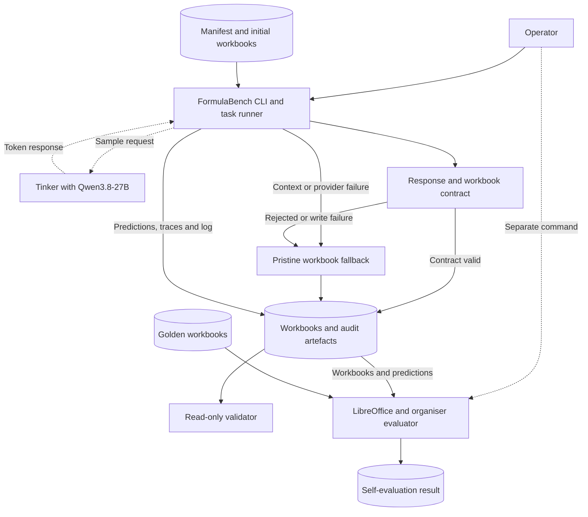
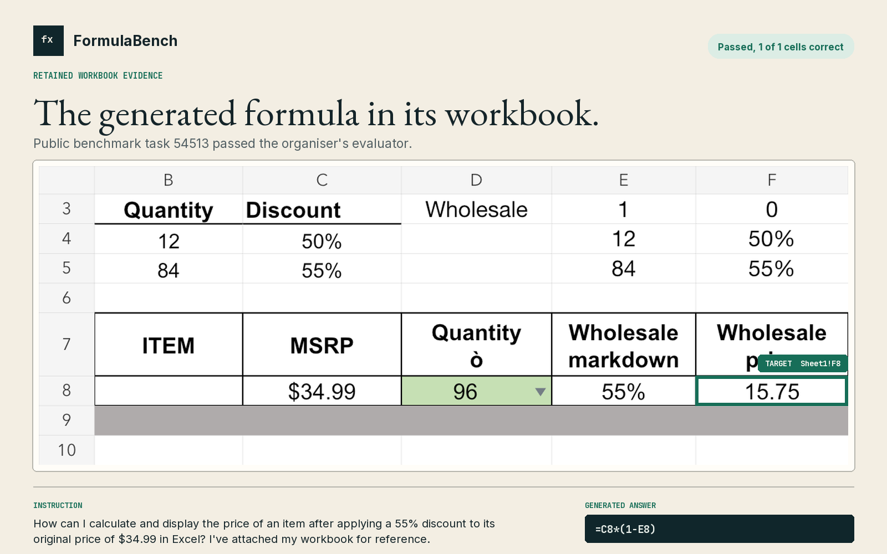
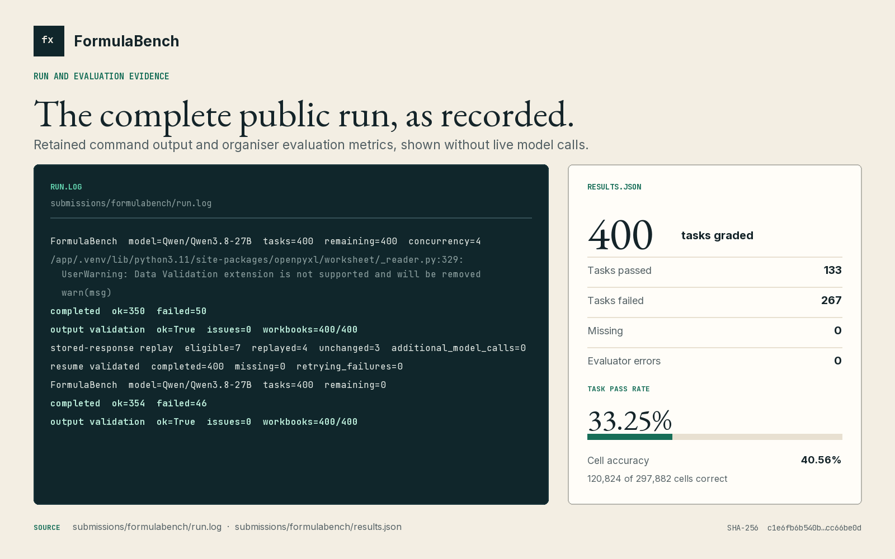

# FormulaBench

A reproducible, fail-closed pipeline for generating and validating Excel formulas.

[](https://github.com/MasteraSnackin/FormulaBench/actions/workflows/ci.yml)

[](SUBMISSION.md)

## Description

FormulaBench takes a plain-English spreadsheet instruction and an initial Excel workbook, then
attempts to produce the requested `.xlsx` workbook using `Qwen/Qwen3.8-27B` through Tinker. It
serves formula-generation researchers and spreadsheet analysts who need generated changes to
remain reviewable. It addresses model outputs that look plausible while missing required cells,
writing to the wrong sheet or introducing unsafe formulas.

The pipeline builds sheet-aware evidence, requests one structured model response, validates exact
target coverage and formula safety, then publishes either a validated edit or a pristine input
fallback. It retains one workbook and trace file per task, plus a prediction record in the shared
checkpoint manifest. A model attempt adds the prompt, any available parsed response, token counts,
latency and failure state to that trace.

This repository is the **Research Track: Excel Formula Generation (SpreadsheetBench)** entry for
the Encode x Ylookup Rebuild Private Markets Hackathon. The frozen 400-task result uses prompt
engineering and deterministic validation rather than fine-tuning. The repository now also contains
a separate, development-only Tinker LoRA experiment; no result from that experiment is included in
the score below.

### Public self-evaluation result

| SpreadsheetBench Verified self-evaluation | Result |
| --- | ---: |
| Tasks graded | 400/400 |
| Tasks passed | 133/400 |
| Pass rate | 33.25% |
| Cell accuracy | 40.56% |
| Cell-level task pass rate | 32.73% |
| Sheet-level task pass rate | 34.40% |
| Missing tasks / evaluator errors | 0 / 0 |

The complete self-evaluation result is in
[`submissions/formulabench/results.json`](submissions/formulabench/results.json), SHA-256
`c1e6fb6b540bb7272f4c537773e2a4826dd649d882c9b7fb549df9bccc66be0d`. A local run with the
organiser-supplied evaluator reported 133 passes from 400 tasks. The
[organiser's Research Track README](https://github.com/ylookup/encode-hackathon/blob/37d9016264762a25cae49e077cd0893055bd9093/research/README.md#L88)
lists a 59.0% one-shot, values-only Qwen3.8-27B reference. FormulaBench disables thinking,
prioritises formulas and applies a stricter fail-closed contract, so the results are not directly
comparable.

### Judge resources

- [Submission overview](SUBMISSION.md)
- [System architecture](ARCHITECTURE.md)
- [Live research overview](https://masterasnackin.github.io/FormulaBench/)
- [Demo video](https://masterasnackin.github.io/FormulaBench/video.html)
- [Presentation viewer](https://masterasnackin.github.io/FormulaBench/presentation.html)
- [Self-evaluation results](submissions/formulabench/results.json)
- [Prediction manifest](submissions/formulabench/predictions.jsonl)
- [Generated workbooks](submissions/formulabench/outputs/)
- [Model traces](submissions/formulabench/traces/)
- [Evaluation and failure analysis](experiments/README.md)
- [Dataset and scaffold provenance](PROVENANCE.md)

## Table of Contents

- [Description](#description)
- [Features](#features)
- [Tech Stack](#tech-stack)
- [Architecture Overview](#architecture-overview)
- [Installation](#installation)
- [Usage](#usage)
- [Configuration](#configuration)
- [Screenshots / Demo](#screenshots--demo)
- [API / CLI Reference](#api--cli-reference)
- [Tests](#tests)
- [Roadmap](#roadmap)
- [Contributing](#contributing)
- [License](#license)
- [Contact / Support](#contact--support)

## Features

- Sheet-qualified targets and formula-aware workbook context from formula and cached-value views.
- A deterministic 20,000-character prompt budget with complete compact ranges and spatial sampling.
- Strict typed responses with exact validation of missing, duplicate and out-of-target cells.
- A static formula safety gate followed by atomic write and reopen checks.
- Pristine input fallbacks when context construction, inference, validation or writing fails.
- Validated resume, explicit failure retry and credential-free replay of eligible stored responses.
- Per-task workbook and trace files, with one prediction record per task in an atomically rewritten
  shared checkpoint manifest.
  A failure before a model call can leave the required trace file empty.
- Read-only output validation with optional scanning for an explicitly configured secret value.
- A deterministic development-only SFT corpus, dry-run-first LoRA trainer and checkpoint evaluation
  path with split, workbook, prompt, answer and row hashes.
- A static GitHub Pages viewer for the retained result, demo video and presentation.

## Tech Stack

| Area | Technology |
| --- | --- |
| Language | Python. The submitted image uses 3.11. `pyproject.toml` declares `>=3.11`. |
| Workbook processing | `openpyxl==3.1.5` |
| Validation | Pydantic 2 |
| Inference | Tinker SDK `0.27.1` with `Qwen/Qwen3.8-27B` |
| Optional training | Tinker Cookbook `0.5.7`, LoRA SFT and held-back development validation |
| Prompt rendering | Transformers chat template and Tokenizers |
| Dependency management | `uv` with a committed lockfile |
| Evaluation | Organiser evaluator and LibreOffice Calc |
| Packaging and runtime | Hatchling and Docker |
| Tests and code quality | pytest and Ruff |
| Continuous integration | GitHub Actions on Ubuntu 24.04 |
| Evidence site | Static HTML, CSS and JavaScript deployed through GitHub Pages |
| Persistence | Local `.xlsx`, JSONL, JSON and log files. No database. |

## Architecture Overview



`formulabench.capture` supervises the production CLI, which loads each task and builds formula-aware
workbook context. For tasks that reach the provider, the runner exchanges one logical sample with
Tinker, applies only responses that pass the contract and uses a pristine fallback for failures,
while the capture supervisor owns the process log. Complete runs validate automatically,
golden-aware scoring stays separate, and the read-only GitHub Pages viewer publishes frozen evidence
outside the inference path, as detailed in [ARCHITECTURE.md](ARCHITECTURE.md).

## Installation

### Requirements

- Git.
- Python 3.11 for parity with the submitted image. The project declares `>=3.11`, but CI does not
  test a multi-version matrix.
- [`uv`](https://docs.astral.sh/uv/).
- Docker for the submitted one-command runtime.
- LibreOffice Calc to rerun recalculation-based scoring locally. Exact parity across LibreOffice
  releases is not established.
- A Tinker account and API key for ordinary inference. The direct Python CLI requires the key only
  while work is pending. The Docker wrapper requires it for every mode except preflight and
  stored-response replay, including a fully completed resume. Tests and validation do not need it.

### Set up from scratch

```sh
git clone https://github.com/MasteraSnackin/FormulaBench.git
cd FormulaBench
uv sync --locked
uv run python data/download.py
```

On a fresh download, the script checks the SpreadsheetBench Verified archive against its pinned
SHA-256 before extraction. The dataset directory is intentionally excluded from Git.

Optional comparison environments are kept out of the production image:

```sh
# Organiser-style OpenRouter comparison dependencies
uv sync --locked --extra baseline

# Native Tinker Cookbook and checkpoint experiments
uv sync --locked --extra native-tinker
```

### Reproduce the safe Tinker training preflight

The training script rebuilds the frozen development-only corpus, verifies it independently,
tokenises all 74 eligible examples and prints the bounded plan. Its default mode makes zero Tinker
provider calls:

```sh
./scripts/run_training.sh
```

Paid training is a separate, explicit action requiring `--execute`, a writable Tinker project, a
local run directory and a key supplied privately through the environment. See the complete
[training protocol](training/README.md), including leakage boundaries, measured token counts,
validation NLL and production-parity checkpoint evaluation. The separate evaluation script runs
the same 15 development-validation tasks through the base and LoRA weights, scores both with the
organiser evaluator and emits a hash-bound comparison. The generated corpus and run metadata are
ignored by Git and do not alter the retained 400-task submission evidence.

## Usage

### Run the submitted Docker workflow

Export `TINKER_API_KEY` in your private shell rather than storing it in the repository. Set
`TINKER_PROJECT_ID` only if the account's default project is read-only. A fresh run requires an
empty output directory and may make Tinker requests that consume credits or incur cost.

```sh
export TINKER_API_KEY="$(python3 -c 'import getpass; print(getpass.getpass("Tinker API key: "))')"
./scripts/run_docker.sh \
  data/spreadsheetbench_verified_400 \
  submissions/my-run
```

The wrapper builds `formulabench:latest`, mounts the dataset read-only at `/data`, mounts the
selected output directory at `/out`, and runs as the current host user.

### Run directly with Python instead

```sh
uv run python -m formulabench.capture \
  --dataset-dir=data/spreadsheetbench_verified_400 \
  --out-dir=submissions/my-python-run
```

Use a known development task for a bounded canary:

```sh
uv run python -m formulabench.capture \
  --dataset-dir=data/spreadsheetbench_verified_400 \
  --out-dir=submissions/canary-54513 \
  --ids=54513
```

### Resume or retry

Ordinary resume reuses only validated checkpoints and does not retry recorded failures:

```sh
./scripts/run_docker.sh \
  data/spreadsheetbench_verified_400 \
  submissions/my-run \
  --resume
```

Reschedule validated failures only when another inference attempt is intentional. A task consumes
credits or incurs cost only if it reaches the provider:

```sh
./scripts/run_docker.sh \
  data/spreadsheetbench_verified_400 \
  submissions/my-run \
  --resume \
  --retry-failures
```

Replay eligible stored `workbook_write_failed` responses after a contract repair, without a
credential or provider call:

```sh
./scripts/run_docker.sh \
  data/spreadsheetbench_verified_400 \
  submissions/my-run \
  --resume \
  --replay-write-failures
```

`--retry-failures` and `--replay-write-failures` are mutually exclusive.

### Validate and score outputs

```sh
uv run python -m formulabench.validate_out \
  --dataset-dir=data/spreadsheetbench_verified_400 \
  --out-dir=submissions/my-run \
  --expected-model=Qwen/Qwen3.8-27B \
  --secret-env=TINKER_API_KEY

uv run python evaluate.py \
  --predictions=submissions/my-run/predictions.jsonl \
  --all \
  --out=submissions/my-run-results.json
```

Keep the score file outside a run that may be resumed. The resume allow-list rejects additional
files at the output root, including `results.json`.

The inference output directory has this stable layout:

```text
submissions/my-run/
├── predictions.jsonl
├── run.log
├── outputs/
│   └── <task-id>.xlsx
└── traces/
    └── <task-id>.jsonl
```

## Configuration

### Production and evaluation environment variables

| Variable | Required | Purpose |
| --- | --- | --- |
| `TINKER_API_KEY` | Docker wrapper except preflight/replay. Direct CLI when inference is pending. | Authenticates the native Tinker sampling client. |
| `TINKER_PROJECT_ID` | Account-dependent | Selects a writable project when the account default is read-only. |
| `FORMULABENCH_IMAGE` | No | Overrides the Docker image name used by `scripts/run_docker.sh`. |
| `SOFFICE` | No | Selects the LibreOffice executable used only by the separate evaluator. |

Do not commit credentials. Tinker telemetry is forced off before client construction and in the
container environment.

### Fixed inference settings

| Setting | Value |
| --- | --- |
| Model | `Qwen/Qwen3.8-27B` |
| Transport | Native Tinker sampling client |
| Renderer | Pinned Qwen3.8 thinking-disabled chat template |
| Tokenizer revision | `1d4bf0f2ff6012fd82039f2fa52739d0dd7c60c0` |
| Thinking | Disabled |
| Temperature | `0` |
| Samples per task attempt | `1` |
| Maximum output tokens | `8,192` |
| Maximum authored prompt | `20,000` characters |
| Provider HTTP retries | `0` |
| Default maximum sampling concurrency | `4` |

Production model settings are centralised in [`formulabench/constants.py`](formulabench/constants.py)
and are not exposed as CLI overrides. The application and runtime dependency resolution is locked
in [`uv.lock`](uv.lock). [`Dockerfile`](Dockerfile) defines the container build and runtime.

Each attempt that reaches the provider requests one logical sample and disables FormulaBench's own
HTTP and sampling retries. The Tinker SDK may still retry idempotent submission or retrieval
operations for that same sample.

## Screenshots / Demo

The FormulaBench inference engine is CLI-based. Its hosted demo is a read-only evidence viewer, not
an inference interface. These panels are built from the retained workbook, process log and result
from the organiser-supplied evaluator, without making a fresh model call.

### Generated workbook



Task `54513` produced `=C8*(1-E8)` in `Sheet1!F8`. The retained workbook displays `15.75`, and the
organiser-supplied evaluator marked its single target cell correct.

### Complete public run



The panel combines exact excerpts from `submissions/formulabench/run.log` with figures derived from
`submissions/formulabench/results.json`. It records the 400-task run, credential-free replay and
final 33.25% task pass rate. The replay made no additional provider calls.

### Demo and presentation

- [Open the live research overview](https://masterasnackin.github.io/FormulaBench/).
- [Watch the 67.4-second demo video](https://masterasnackin.github.io/FormulaBench/video.html).
- [View the eight-slide presentation](https://masterasnackin.github.io/FormulaBench/presentation.html),
  [open the PDF](presentation/FormulaBench-Hackathon-Deck.pdf), or
  [download the PowerPoint source](presentation/FormulaBench-Hackathon-Deck.pptx).

GitHub Pages serves this static evidence surface. It cannot upload a workbook or invoke Tinker.

<details>
<summary>Accessible run transcript</summary>

```text
# Initial run
FormulaBench  model=Qwen/Qwen3.8-27B  tasks=400  remaining=400  concurrency=4
completed  ok=350  failed=50
output validation  ok=True  issues=0  workbooks=400/400

# Stored-response replay and final validation
stored-response replay  eligible=7  replayed=4  unchanged=3  additional_model_calls=0
completed  ok=354  failed=46
output validation  ok=True  issues=0  workbooks=400/400
```

</details>

## API / CLI Reference

FormulaBench exposes a CLI rather than an HTTP API. Display the full local reference with:

```sh
uv run python -m formulabench.capture --help
```

| Argument | Behaviour |
| --- | --- |
| `--dataset-dir PATH` | Required SpreadsheetBench dataset directory. |
| `--out-dir PATH` | Required empty output directory, or an existing run with `--resume`. |
| `--ids ID[,ID...]` | Restricts execution to validated task IDs. |
| `--concurrency N` | Maximum concurrent remote sampling calls from 1 to 64, with a default of 4. |
| `--preflight-only` | Validates the fixed native runtime without sampling the model. |
| `--resume` | Validates and continues an existing output directory. |
| `--retry-failures` | With `--resume`, reschedules failed checkpoints and may make new provider calls. |
| `--replay-write-failures` | With `--resume`, reuses eligible stored responses with zero model calls. |

There is no declared stable Python library API. Internal modules and formats may change until the
project adopts a versioned public interface.

## Tests

Run the credential-free local checks:

```sh
uv run pytest
uv run ruff check formulabench tests experiments training baseline/tinker_predict.py
uv run ruff format --check formulabench tests experiments training baseline/tinker_predict.py
uv run python evaluate.py --oracle
```

Build the same container targets used by CI:

```sh
docker build --target contract-test -t formulabench:contract-test .
docker build --target runtime -t formulabench:latest .
```

GitHub Actions also downloads the checksum-verified public dataset and verifies the all-400 target
contracts and frozen split. See the [current workflow](https://github.com/MasteraSnackin/FormulaBench/actions/workflows/ci.yml).

## Roadmap

These are proposed improvements, not claims about the frozen 400-task result:

- Route cell-level formula requests and sheet-level transformations through separate strategies.
- Compile large filtering, sorting, appending, grouping and clearing tasks into deterministic
  operations instead of model-enumerated cells.
- Make workbook retrieval task-aware and token-aware to reduce context truncation.
- Recalculate candidates in an isolated LibreOffice process and reject runtime formula errors
  before publication.
- Add formula compatibility normalisation and output invariants.
- Generate and verify the hosted evidence metrics from the hashed evaluation result during
  deployment.
- Compare the base model and development-only LoRA checkpoint through controlled validation, then
  make a post-freeze comparison on the historically named `held_out` reporting bucket.

See [`experiments/README.md`](experiments/README.md) for the failure analysis behind the retrieval,
task-routing, deterministic-operation and controlled-comparison priorities.

## Contributing

Use [GitHub Issues](https://github.com/MasteraSnackin/FormulaBench/issues) to report a defect, propose
an experiment or discuss a change. GitHub sign-in is required. The repository does not yet declare
code-contribution terms, so agree the scope with the maintainer before preparing a pull request.
Do not copy, modify or redistribute code unless the relevant rights holders have granted permission.

Never commit API keys, private workbooks, the downloaded dataset or unredacted provider data.
Any authorised change must preserve fail-closed writes, deterministic artefacts and an honest
separation between development evidence and unseen private evaluation.

## License

This repository does not currently declare a project code licence and contains no `LICENSE` file.
Do not assume permission to reuse, modify or redistribute the project code. The public dataset is
separately identified by the organisers as CC BY-SA 4.0, and the referenced Qwen model declares
Apache-2.0. Neither grants a licence for FormulaBench itself. See [PROVENANCE.md](PROVENANCE.md) for
the recorded upstream, dataset and model boundaries.

## Contact / Support

- Repository owner and declared team member: [MasteraSnackin](https://github.com/MasteraSnackin)
- Bug reports and research proposals: [GitHub Issues](https://github.com/MasteraSnackin/FormulaBench/issues)
- Repository: [github.com/MasteraSnackin/FormulaBench](https://github.com/MasteraSnackin/FormulaBench)

No public support email or service-level commitment is declared.
